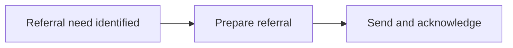

# Contributing to the eCHIS Implementation Portal

This portal is written in plain Markdown. You don't need to know React, Docusaurus or any code to contribute. If you can edit a text file, you can edit this site.

## Who owns what

Each section has an owning team. The owner writes and approves pages in their section; anyone can suggest changes.

| Section | Folder | Owner (proposed) |
|---|---|---|
| Community health workflows | `docs/workflows/` | Ona |
| Integration workflows | `docs/integrations/` | OpenFn |
| Reference architecture | `docs/architecture/` | Data.FI |
| Standards & interoperability | `docs/standards/` | Data.FI |
| Implementation guidance | `docs/implementation/` | Data.FI |

The `owner:` field at the top of each page says who owns that page.

## How the site is organised

```
docs/
  workflows/        one page per service workflow
  integrations/     one page per interface (DCS.INT.* IDs)
  architecture/     overview + one page per component in components/
  standards/        how FHIR, terminology and metadata packages are used
  implementation/   governance, configuration, testing, go-live, operations
templates/          copy these to start a new page
```

Each folder becomes a tab in the top menu, and each file becomes a page in that tab's side menu. Adding a file adds a page. No menu configuration needed.

## Edit an existing page

**In the browser (easiest):**

1. On the page you want to change, click **Edit this page** at the bottom. This opens the file on GitHub.
2. Click the pencil icon.
3. Make your changes.
4. At the bottom, choose **Create a new branch and start a pull request**, then submit.

**On your computer:** see [Run the site locally](#run-the-site-locally).

## Add a new page

1. Copy the matching template from `templates/`:

   | Adding a… | Template | Put it in |
   |---|---|---|
   | Workflow | `templates/workflow.md` | `docs/workflows/` |
   | Integration | `templates/integration.md` | `docs/integrations/` |
   | Component | `templates/component.md` | `docs/architecture/components/` |
   | Guidance or standards page | `templates/guide.md` | `docs/implementation/` or `docs/standards/` |

2. Name the file with lowercase words and hyphens, e.g. `stock-adjustment.md`. The file name becomes the web address.
3. Fill in the header block at the top (between the `---` lines) and the sections. Delete any section that doesn't apply.
4. Open a pull request.

## The header block

Every page starts with this:

```yaml
---
title: Community referral to facility      # shown as the page title
description: One sentence summary.          # shown in search and link previews
sidebar_position: 20                         # order in the side menu (use 10, 20, 30…)
owner: OpenFn                                # team responsible for this page
status: draft                                # draft | in-review | approved
dcs_id: DCS.INT.REF.01                       # stable ID from the Implementation Guide
---
```

## Linking between pages

The portal is valuable because everything links together. When a page mentions another workflow, integration, component or standard, link to it.

- Link to another page by its file path: `[Community referral](../integrations/community-referral.md)`
- Link into the FHIR Implementation Guide for profiles and value sets: `[eCHIS Service Request](https://palladium-group.github.io/datafi-echis-ig/)`

**Broken links stop the build.** If you rename or move a page, update the links that point to it. The build error tells you where they are.

**Metadata packages** are always listed on the component page that ships them, and on the standards page they implement. Don't create standalone package pages.

## Diagrams

Draw diagrams as text with [Mermaid](https://mermaid.js.org/). The templates include examples:

````md

````

## Writing style

- Write for implementers in-country: plain language, short sentences.
- Start headings at `##` (the title is the page's top heading) and don't skip levels.
- Give every image alt text.
- Keep tables narrow so they read on a phone.
- Put detailed field mappings in the linked mapping file or repository, not in the page.

## Run the site locally

Requires Node.js 20 or newer.

```bash
npm install
npm start          # opens http://localhost:3000 with live reload
npm run build      # the same check the pull request runs, including broken links
```

## Review and approval

1. Open a pull request.
2. The automatic build check must pass.
3. The section owner reviews and approves.
4. On merge, the site redeploys automatically (once hosting is set up).
