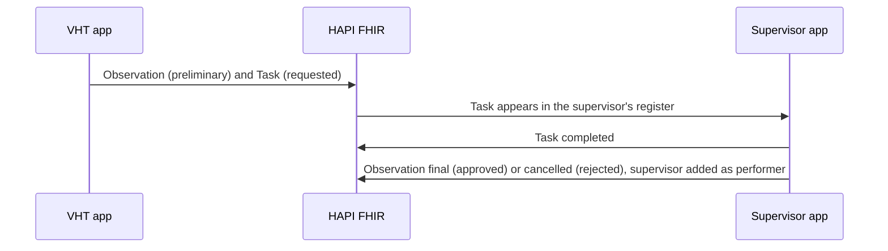

## Role in the architecture

Mobile app for supervisors to verify signals, approve reports and oversee CHW work. It gives facility-based supervisors visibility over their team of VHTs, a workflow for verifying community-reported events, and tools for recording supervisory visits and approving reports that need clinical sign-off.

## Technology

| Item | Value |
|---|---|
| Platform | A separate OpenSRP 2 (FHIR Core) app flavor, `echisDataFiSupervisor` |
| Data | The same [HAPI FHIR](./hapi-fhir.md) server as the CHW app, through the FHIR Information Gateway |
| Scope | The CHWs assigned to the supervisor in the [web administration portal](./web-admin.md) |
| Sign-in | Application ID, username and password on first login, then a PIN |

## Registers

| Register | Contents |
|---|---|
| CHWs | The CHWs assigned to this supervisor, with a **VHT Visit** button on each |
| CEBS Incoming Signals | Signals waiting for review |
| Approval Tasks | AFP screens and death reports waiting for approval |
| CEBS History | Signals already handled |
| Reports | Monthly and full-year summaries |

Opening a CHW shows their profile and the registers on their device (Households, Children, Sick Child, ANC, PNC, Family Planning, HIV, Tuberculosis, Inventory). These are **read-only** in the supervisor app. Supervisors can also report a CEBS signal themselves. Peer-to-peer transfer is not in use. Data is synced manually from the side menu.

## Workflows it supports

| Workflow | Supervisor action | Task code |
|---|---|---|
| [Community event-based surveillance](../../workflows/community-event-based-surveillance.md) | Verify a signal by phone or field visit, record risk and affected counts | `verify-signal` |
| [Child health](../../workflows/child-health-immunization.md) (AFP screening) | Approve or reject a suspected acute flaccid paralysis case | `approve-afp-screening` |
| [Death reporting](../../workflows/death-reporting.md) | Approve or reject a death report and confirm registrar notification | `approve-death-report` |
| Supervisory visit | Record a structured check of a VHT | — |

### How approvals work

All three approval workflows follow one pattern. The supervisor never creates a new record. They complete the VHT's existing ones, so each event keeps one record with both the reporter and the verifier on it.

### Supervisory visit

Opened from **VHT Visit** on the CHWs register. The form covers:

- **Check-in:** whether the VHT is available and well, has a working device, and which modules they are trained on
- **Programme management:** workplan, monthly service report, community meetings, referrals needing support
- **Supply chain:** physical count, damaged or expired stock, adjustments and restocking
- **Modules 1 to 4:** activities completed since the last visit
- **Summary:** forms reviewed, how many had the correct treatment, and whether an observational home visit was done

It creates one Encounter anchored to the VHT's team rather than to a patient.

## Integrations

- [Surveillance and configured alerts](../../integrations/surveillance-alerts.md): a completed `verify-signal` Task triggers the CEBS submission to DHIS2 and, for confirmed threats, a RapidPro alert

## Standards

- HL7 FHIR R4 Task and Observation, using the eCHIS Surveillance Task and Surveillance Observation profiles
- Task codes from the eCHIS code systems. See [Terminology](../../standards/terminology.md)

## Metadata packages

| Package | Contents |
|---|---|
| Questionnaires | Supervisor visit, AFP approval, death report approval, CEBS verification |
| Extraction maps | One per questionnaire above |
| Register configs | CHWs, approval tasks, CEBS incoming signals, CEBS history |
| Profile and report configs | CEBS signal profile, monthly supervisor indicators |
| Navigation | Supervisor app flavor navigation |

See the [Metadata packages index](../../standards/metadata-packages.md).

## Setup & configuration

See [Configuration](../../implementation/configuration.md) and the supervisor guide under [Training](../../implementation/training.md).
