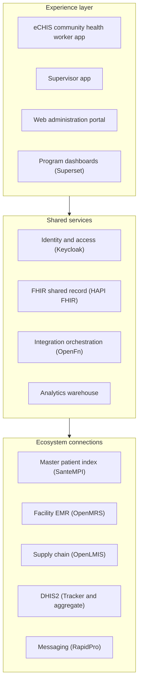

:::info Page details
**Owner:** Data.FI (proposed) · **Status:** Draft
:::

The Data.FI reference eCHIS is one implementation of a digital community system. Country teams may adopt it, adapt selected components, or reuse the workflows and integration patterns with another platform.

The reference solution is configuration-driven and offline-first. It combines mobile applications, web administration, identity and access management, a FHIR server, integration orchestration, analytics pipelines, a data warehouse, dashboards, and platform monitoring. It connects to identity, facility, logistics, surveillance, messaging, clinical, and national reporting systems.

A community health worker completes a questionnaire. Template extraction creates structured FHIR records and, when required, the next task. The reference model uses successor tasks for scheduling, aligns selected records with International Patient Summary concepts, and applies selective synchronization so devices receive the records needed for frontline work. Other records can support analytics. The machine-testable contract is the [FHIR Implementation Guide](https://palladium-group.github.io/datafi-echis-ig/). See [Standards](../standards/index.md).

Governance, privacy, security, infrastructure, monitoring, backup and recovery, release management, documentation and support apply across every layer.

## Components

| Component | Layer |
|---|---|
| [eCHIS community health worker app](./components/echis-app.md) | Experience |
| [Supervisor app](./components/supervisor-app.md) | Experience |
| [Web administration portal](./components/web-admin.md) | Experience |
| [Program dashboards (Superset)](./components/superset.md) | Experience |
| [Identity and access (Keycloak)](./components/keycloak.md) | Shared services |
| [FHIR shared record (HAPI FHIR)](./components/hapi-fhir.md) | Shared services |
| [Integration orchestration (OpenFn)](./components/openfn.md) | Shared services |
| [Analytics warehouse](./components/analytics-warehouse.md) | Shared services |
| [Master patient index (SanteMPI)](./components/santempi.md) | Ecosystem connections |
| [Facility EMR (OpenMRS)](./components/openmrs.md) | Ecosystem connections |
| [Supply chain (OpenLMIS)](./components/openlmis.md) | Ecosystem connections |
| [DHIS2 (Tracker and aggregate)](./components/dhis2.md) | Ecosystem connections |
| [Messaging (RapidPro)](./components/rapidpro.md) | Ecosystem connections |
