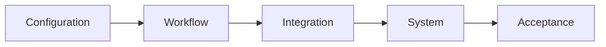

Build assurance into delivery. Testing should trace back to approved requirements.

| Stage | What to prove |
|---|---|
| Configuration | Forms, rules, terminology, access, tasks, and sync behave as specified |
| Workflow | User scenarios, decisions, follow-up, and closure match the approved workflow |
| Integration | Contracts, mappings, metadata, errors, and replay behave as specified |
| System | Performance, security, recovery, and observability meet the operating conditions |
| Acceptance | Users approve the release and the launch decision is recorded |

## Test cases

For each workflow and interface, cover positive, negative, boundary, offline, synchronization, duplicate, referral, and recovery cases. Integration tests also cover contract, volume, replay, and end-to-end paths.

Each workflow and integration page lists its assurance focus. Detailed cases belong in the test repository linked from those pages, with a test and acceptance record that keeps scenarios, expected results, evidence, defects, retest, and approval.

## Defect management

Record severity, affected workflow, environment, owner, resolution, retest result, and release decision for every defect.

Before production activation, complete end-to-end, negative, replay, performance, security, and reconciliation testing. Retain evidence of security, privacy, program, and operational review.
