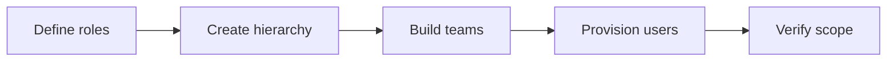

:::info Page details
**Owner:** Data.FI (proposed) · **Status:** Draft
:::

## Content and behavior

## Users, organizations and locations

```mermaid
flowchart LR
  A[Define roles] --> B[Create hierarchy] --> C[Build teams] --> D[Provision users] --> E[Verify scope]
```

## Tasking and scheduling

## Integration settings
