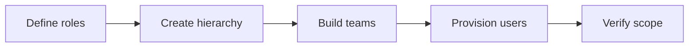

:::info Page details
**Owner:** Data.FI (proposed) · **Status:** Draft
:::

Configuration turns approved workflows and requirements into content and behavior that can be tested and released. Track every configured item in a configuration inventory: forms, terminology, settings, repositories, versions, environments, and owners. The [reference architecture](../architecture/index.md) shows one way to host this configuration.

## Content and behavior

| Domain | What to configure |
|---|---|
| Application experience | Menus, labels, navigation, feature flags, language, accessibility, device settings, and user feedback |
| Forms and rules | Questionnaires, validation, conditional display, calculations, decision support, and extraction logic |
| Terminology | Code systems, value sets, concept maps, approved displays, translations, and terminology ownership. See [Terminology](../standards/terminology.md) |
| People and access | Users, groups, roles, permissions, authentication, service accounts, and privileged access |
| Organizations and locations | Administrative hierarchy, facilities, community units, organizations, care teams, and assignments |
| Tasking and scheduling | Task types, priorities, due rules, successor logic, status transitions, reminders, and exceptions |
| Reporting and analytics | Indicators, warehouse models, refresh schedules, exports, dashboards, and reconciliation |
| Integration settings | Endpoints, metadata, credentials, triggers, cursors, retries, idempotency, and monitoring. See [Integrations](../integrations/index.md) |

Reference endpoints, credentials, metadata identifiers, schedules, and logging examples must be replaced with approved country values before production. See [production hardening](../integrations/index.md#harden-for-production).

## Users, organizations and locations

1. Agree user types and permissions.
2. Load approved locations and organizations.
3. Create care teams and assignments.
4. Create accounts and apply roles.
5. Test access, data visibility, and reassignment.

## Tasking and scheduling

Define task types, priorities, due windows, successor tasks, status transitions, reminders, and exceptions. Offline work should save a complete local transaction, prevent double submission, and queue synchronization. In the reference eCHIS, a completed questionnaire can close the current task and create the next one. See [Standards](../standards/index.md).

## Integration settings

Keep credentials, endpoints, and schedules in the environment that will run them. Validate metadata, terminology, identifiers, and permissions in that environment before activation.
