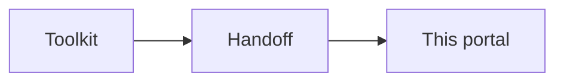

This guide begins when a country is ready to turn Digital Community System Toolkit decisions into specifications, configuration, integrations, deployment, and operations. The Toolkit supports collaborative planning and person-centered design. This portal starts at the handoff: approved scope, priorities, owners, requirements inputs, and a roadmap.

## Choose an entry point

| Starting from | Begin with |
|---|---|
| Policy and strategy | The DCS Toolkit: ecosystem assessment, vision, governance, and use-case prioritization before detailed technical design |
| An existing product | Toolkit to validate users, priorities, and governance, then this portal to assess gaps, define adaptation, and plan releases |
| A defined roadmap | [Governance](./governance.md), then confirm inputs and scope before configuration or integration |
| A deployed system | [Integrations](../integrations/index.md) and [Assurance](./assurance-testing.md), then monitoring, support, and release management |
| Building a reusable reference | [Workflows](../workflows/index.md), [Standards](../standards/index.md), configuration packages, and interface specifications |
| Preparing for scale | [Go-live](./go-live-deployment.md) and [Operations](./operations-sustainability.md) |

## Confirm the implementation inputs

Before technical work begins, confirm that planning outputs are mature enough to guide implementation. Gaps can be closed in focused design sessions. They do not require reopening the full planning process.

| Input | What to confirm |
|---|---|
| Ecosystem | Existing systems, infrastructure, standards, constraints, and maturity |
| Users | Validated personas, responsibilities, contexts, and pain points |
| Priorities | Ranked use cases and an agreed first release |
| Governance | Decision rights, product ownership, and approval routes |
| Roadmap | Milestones, resources, risks, and implementation sequence |

## Readiness questions

- Is there a named government product owner with authority to prioritize scope and accept releases?
- Are priority users and service-delivery workflows documented and validated?
- Are the first-release use cases explicit and feasible within available resources?
- Are relevant policies, standards, data-protection requirements, and architecture constraints identified?
- Are source systems, systems of record, identifiers, reporting obligations, and integration owners known?
- Are implementation, operations, support, and recurrent-cost responsibilities assigned?

When these answers are clear, continue with [Governance and ownership](./governance.md) and [Solution design](./solution-design.md).
