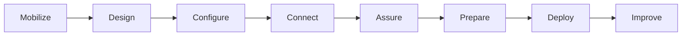

:::info Page details
**Owner:** Data.FI (proposed) · **Status:** Draft
:::

The pathway is iterative. Keep traceability from each approved user need to a workflow, requirement, configuration or code asset, test result, release decision and operational measure.

- [Getting started](./getting-started.md)
- [Governance and ownership](./governance.md)
- [Solution design and requirements](./solution-design.md)
- [Configuration](./configuration.md)
- [Assurance and testing](./assurance-testing.md)
- [Go-live and deployment](./go-live-deployment.md)
- [Training](./training.md)
- [Operations and sustainability](./operations-sustainability.md)
- [Templates and assets](./templates.md)
