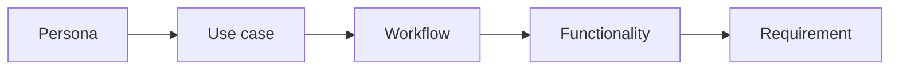

:::info Page details
**Owner:** Data.FI (proposed) · **Status:** Draft
:::

Use the personas and prioritized use cases from the Toolkit as the basis for implementation. Begin with the user outcome, operating context, service workflow, and information needed to complete the work. Screens and products come after that.

## Document each priority workflow

The narrative should be readable by program and service-delivery teams. The detailed model should be precise enough for configuration, integration, and testing. Each workflow in [Community health workflows](../workflows/index.md) uses this structure.

| Topic | What to record |
|---|---|
| Trigger and eligibility | What starts the workflow, who qualifies, and what information must already exist |
| Actors and locations | Who initiates, performs, reviews, receives, approves, or follows up, and where work occurs |
| Service steps | Actions in service order, including offline work, handoffs, and information shown to the user |
| Decisions and rules | Conditional paths, calculations, validation, alerts, escalation, and decision support |
| Records and terminology | Data captured or reused, identifiers, code systems, minimum data, and source of truth |
| Tasks and follow-up | Scheduling, priority, due windows, reassignment, successor tasks, closure, and overdue behavior |
| External exchange | Systems, direction, payload, timing, acknowledgment, return flow, and reconciliation |
| Completion and measures | Completion state, user confirmation, indicators, acceptance criteria, and monitoring |

Clinical content comes from approved national and WHO guidance. The workflow states where the system invokes that logic. It does not invent clinical rules. Each rule should name its source, approving authority, version, effective date, and linked test cases.

## Requirement form

Translate each workflow into functional and non-functional requirements. Functional requirements describe the system behavior needed to support users. Non-functional requirements set the conditions under which the solution must operate: offline use, performance, security, privacy, scalability, accessibility, maintainability, and supportability.

The system shall [behavior] for [user or system] when [condition] so that [service outcome].

Acceptance criteria should define observable evidence, including positive, negative, offline, synchronization, and error-recovery scenarios. Link each requirement to its source use case and to a workflow, asset, and test. See [Assurance and testing](./assurance-testing.md).

## Release model

Maintain one product backlog. Label requirements by release.

| Release | Scope |
|---|---|
| Minimum viable release | Priority workflows, essential integrations, minimum reporting, and support readiness |
| Expanded release | Additional service packages, richer decision support, more integrations, and dashboards |
| Scaled national product | Standardized governance, reusable configuration, controlled variants, and sustainable operations |

Assess country-specific requests for policy alignment, user value, reuse potential, interoperability impact, cost, maintenance, and testing needs.
