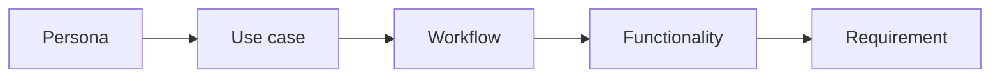

:::info Page details
**Owner:** Data.FI (proposed) · **Status:** Draft
:::

## Requirement form

The system shall [behavior] for [user or system] when [condition] so that [service outcome].

## Release model
