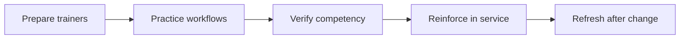

:::info Page details
**Owner:** Data.FI (proposed) · **Status:** Draft
:::

Training should combine service-delivery content and application practice. Prepare supervisors, administrators, and support teams before frontline deployment. Use a distinct training environment with resettable accounts and realistic scenarios. See [Environments and infrastructure](../architecture/environments-infrastructure.md).

Training evidence should include competency checks, not attendance alone.

| Step | What it covers |
|---|---|
| Prepare trainers | Product, service, facilitation, and support readiness |
| Practice workflows | Role-based scenarios and common exceptions |
| Verify competency | Observed tasks and troubleshooting |
| Reinforce in service | Supervision, coaching, job aids, and support |
| Refresh after change | Targeted learning linked to releases |

## User guides

Role-based community health worker, supervisor, administrator, and support guides are companion resources. They describe current application behavior. This page describes how training is planned and evidenced. Link each guide from the release package when it is approved.
