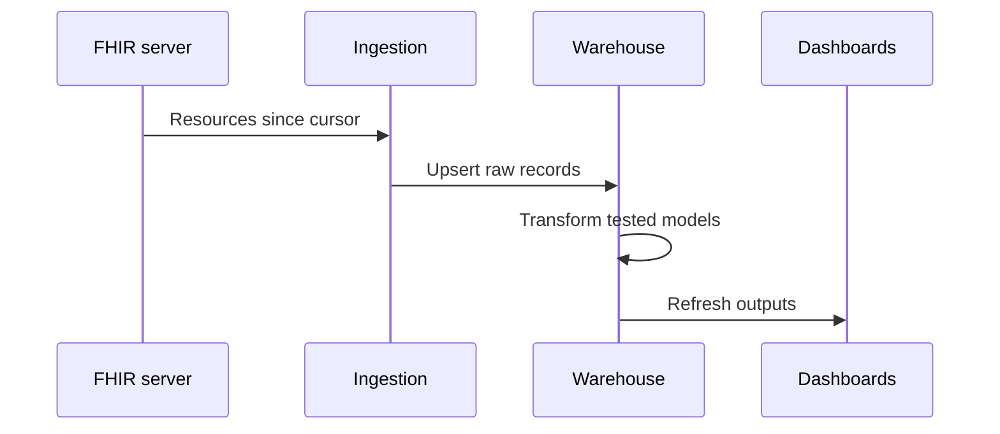
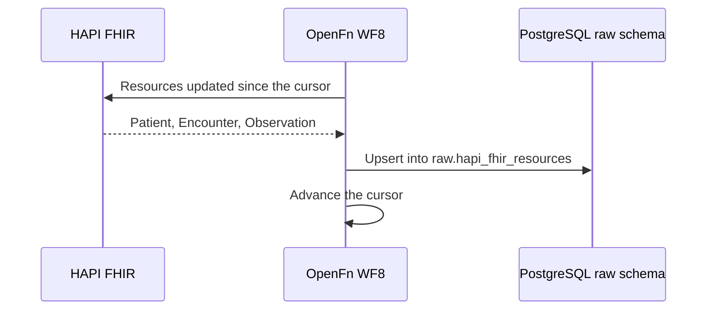

## Overview

| Field | Value |
|---|---|
| Outcome | New and changed approved FHIR resources are loaded into governed analytical models for dashboards, indicators, and reporting |
| Pattern | Analytical |
| Route | FHIR server → ingestion → raw warehouse → transformations → analytical marts and dashboards. Reference: HAPI FHIR, warehouse, Superset |
| Trigger | A scheduled incremental run, or an approved event trigger |
| OpenFn workflow | WF8 · Data warehouse ingest |
| Used by workflows | [Scheduled community visit](../workflows/scheduled-community-visit.md) and any workflow whose records are approved for analytics |

## Components involved

- [FHIR shared record (HAPI FHIR)](../architecture/components/hapi-fhir.md)
- [Analytics warehouse](../architecture/components/analytics-warehouse.md)
- [Program dashboards (Superset)](../architecture/components/superset.md)

## Sequence

## Preconditions

Approved resource types, a cursor or last-updated boundary, and tested transformation models.

## Processing steps

1. Read by cursor or last-updated boundary.
2. Retain source identifiers and versions.
3. Upsert raw records.
4. Quarantine invalid records.
5. Transform into tested models.
6. Refresh outputs.
7. Publish a run summary.

## Mapping

Map approved FHIR paths into raw and analytical models. A dashboard value must trace to a source version. Full mappings stay in the warehouse repository.

## Reliability

Use a safe overlap window and a deterministic upsert. Define deletion and correction behavior. Handle schema changes. Support backfill and replay. Keep lineage from the dashboard value to the source version.

## Security

Ingest only approved resource types. Apply the same access and retention rules as the analytical environment. Do not widen who can see individual records by copying them into a dashboard extract.

## Monitoring

Resources read, inserted, updated, quarantined, and delayed. Transformation tests passed or failed. Model freshness. Dashboard refresh status.

## Reference implementation

How OpenFn WF8 implements this interface in the reference eCHIS. Full field mappings are kept in the eCHIS Mapping Specification.

OpenFn reads the configured resource types (Patient, Encounter and Observation) changed since the last run, and upserts each one into `raw.hapi_fhir_resources`. Staging and analytics models are then built from that table, including the `dhis2_export` model that [routine reporting](./routine-reporting.md) sends.

| Column | Source | Rule |
|---|---|---|
| `resource_type` | `resourceType` | Part of the upsert key |
| `resource_id` | `id` | Part of the upsert key |
| `version_id` | `meta.versionId` | Overwritten with the latest version |
| `last_updated_at` | `meta.lastUpdated` | Drives the incremental `_lastUpdated` filter |
| `source_url` | Server URL, type and id | Added by the workflow |
| `extracted_at` | Fetch time | Also used to advance the cursor |
| `data_payload` | Whole resource | Stored as JSON |

### Safeguards

- Upserting on type and id means a re-run never creates duplicates.
- `data_payload` holds patient demographics, so it is kept out of OpenFn run logs.

## Standards & FHIR artifacts

See the [eCHIS FHIR Implementation Guide](https://palladium-group.github.io/datafi-echis-ig/). Selective sync keeps device-needed records on the client. This interface loads the records approved for analytics.

## Metadata packages

- Warehouse `raw`, `staging` and `analytics` schemas and their models
- OpenFn WF8 job, resource type list and credentials

See the [Metadata packages index](../standards/metadata-packages.md).

## Tests

Incremental cursor with overlap. Invalid record quarantined. Correction and deletion. Schema change. Backfill. Replay. Lineage from a dashboard value to the source version.
