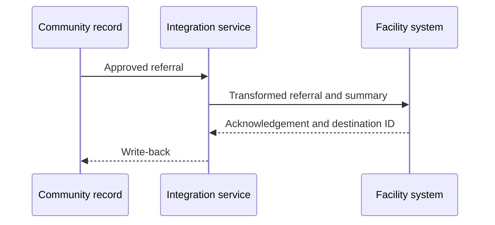
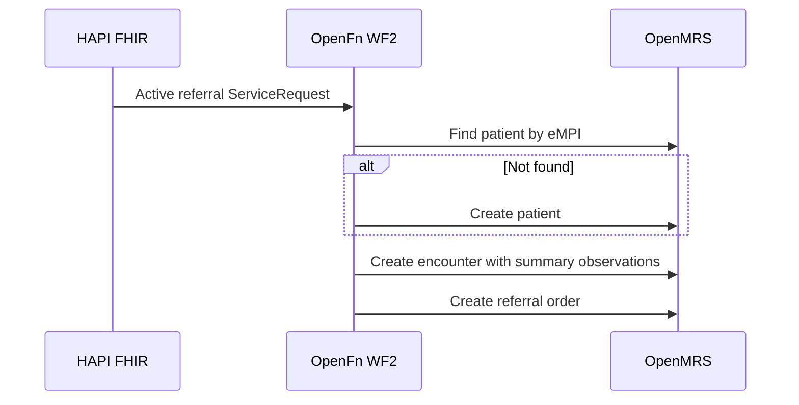

## Overview

| Field | Value |
|---|---|
| Outcome | A community referral and relevant health summary become available to the receiving facility without creating duplicate people or referrals |
| Pattern | Closed-loop |
| Route | Community record → integration service → facility EMR or referral system. Reference: eCHIS, OpenFn, OpenMRS |
| Trigger | An approved referral record enters the ready-to-send state |
| OpenFn workflow | WF2 · eCHIS to OpenMRS |
| Used by workflows | [Referral and counter-referral](../workflows/referral-counter-referral.md), [Maternal and newborn continuity](../workflows/maternal-newborn-continuity.md), [Child health and immunization](../workflows/child-health-immunization.md) |

## Components involved

- [FHIR shared record (HAPI FHIR)](../architecture/components/hapi-fhir.md)
- [Integration orchestration (OpenFn)](../architecture/components/openfn.md)
- [Facility EMR (OpenMRS)](../architecture/components/openmrs.md)

## Sequence

## Preconditions

Resolved person identity, a known destination, consent or another legal basis for disclosure, and approved referral metadata.

## Processing steps

1. Resolve patient identity.
2. Identify the destination.
3. Transform the referral and the minimum summary.
4. Create or update the facility referral, order, or encounter representation.
5. Store destination identifiers and the acknowledgment.

## Mapping

Minimum data: person identifiers; referral reason and urgency; referring actor and location; destination; relevant summary; timestamps; consent or disclosure basis; source record IDs. Full field mappings stay in the mapping repository.

## Reliability

Use an idempotent referral key. Validate the destination. Retry and hold when the destination is unavailable. Detect duplicates. Record the response and write-back. Reconcile periodically.

## Security

Send only the approved summary. Apply disclosure rules before transform. Use least-privilege credentials. Do not put the clinical summary in logs or notifications.

## Monitoring

Referrals ready to send, accepted, rejected, held, duplicated, and missing write-back. Track acknowledgment latency.

## Reference implementation

How OpenFn WF2 implements this interface in the reference eCHIS. Full field mappings are kept in the eCHIS Mapping Specification.

**Trigger:** OpenFn polls HAPI FHIR for active referral ServiceRequests (SNOMED `3457005` Patient referral). One query also brings back the triggering Encounter, Observations, Conditions, Procedures and the requesting Practitioner.

1. **Resolve the patient** in OpenMRS by eMPI only, using the native REST patient search. There is no fuzzy match.
2. **Create the patient** when no match is found: names, gender, birth date, deceased flag, phone (as a person attribute), the eMPI identifier and a generated OpenMRS ID. Address is not mapped because the eCHIS Patient carries none.
3. **Create one encounter** at the receiving facility, dated to the CHW visit rather than the sync time. It holds three text observations: the referral reason, a community health history summary, and a link back to the source ServiceRequest that [counter-referral](./counter-referral.md) uses.
4. **Create the referral order** (subtype `referralorder`) on that encounter, with the referral concept, urgency, reason and CHW attribution.

All writes use the OpenMRS native REST API, because its FHIR API exposes ServiceRequest read-only.

### Key mappings

| Referral type (eCHIS) | OpenMRS concept (CIEL) |
|---|---|
| `anc` | Prenatal care referral (1371) |
| `pnc` | Postnatal care referral (1372) |
| `child` | Other (5622) |
| `hiv` | Referral for antiretroviral therapy (1610) |
| `fp` | Family planning services (5483) |
| `tb` | Tuberculosis treatment or DOT program (5487) |

| Field | Rule |
|---|---|
| Gender | FHIR `male`/`female` maps to OpenMRS `M`/`F`, otherwise `U` |
| Urgency | `urgent` and `asap` map to `STAT`. `routine` maps to `ROUTINE` |
| Referral reason | Text observation, CIEL 164359 "Reason for referral (text)" |
| History summary | Text observation, CIEL 160221 "Past medical history added (text)", one line per finding, newest first |
| Source referral link | Text observation on a local concept, value `ServiceRequest/<id>` |
| Order date | The referral's authored date, never in the future and never before the encounter |

### Safeguards

- **Depends on [identity reconciliation](./identity-reconciliation.md).** If the patient has no eMPI yet, the run stops for that referral and picks it up on the next poll after WF1 has stamped it.
- OpenMRS needs both the order subtype and the order type on the order, or it rejects it.
- One encounter per referral keeps a single target for the order.

## Standards & FHIR artifacts

See the [eCHIS FHIR Implementation Guide](https://palladium-group.github.io/datafi-echis-ig/) for the referral ServiceRequest profile.

## Metadata packages

- OpenMRS referral order type (`referralorder`), the referral concepts above and the local "Source referral reference" concept
- OpenMRS eMPI patient identifier type and the phone person attribute type
- OpenFn WF2 job and credentials

See the [Metadata packages index](../standards/metadata-packages.md).

## Tests

Known and unknown patient. Destination unavailable. Missing metadata. Duplicate replay. Rejected referral. Partial creation. Delayed acknowledgment.
