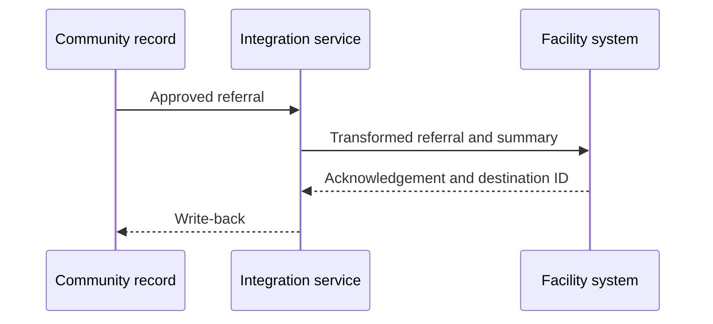

:::info Page details
**Interface ID:** `DCS.INT.REF.01` · **Owner:** OpenFn (proposed) · **Status:** Draft
:::

## Overview

| Field | Value |
|---|---|
| Outcome | A community referral and relevant health summary become available to the receiving facility without creating duplicate people or referrals |
| Pattern | Closed-loop |
| Route | Community record → integration service → facility EMR or referral system. Reference: eCHIS, OpenFn, OpenMRS |
| Trigger | An approved referral record enters the ready-to-send state |
| Used by workflows | [Referral and counter-referral](../workflows/referral-counter-referral.md), [Maternal and newborn continuity](../workflows/maternal-newborn-continuity.md), [Child health and immunization](../workflows/child-health-immunization.md) |

## Components involved

- [FHIR shared record (HAPI FHIR)](../architecture/components/hapi-fhir.md)
- [Integration orchestration (OpenFn)](../architecture/components/openfn.md)
- [Facility EMR (OpenMRS)](../architecture/components/openmrs.md)

## Sequence

## Preconditions

Resolved person identity, a known destination, consent or another legal basis for disclosure, and approved referral metadata.

## Processing steps

1. Resolve patient identity.
2. Identify the destination.
3. Transform the referral and the minimum summary.
4. Create or update the facility referral, order, or encounter representation.
5. Store destination identifiers and the acknowledgment.

## Mapping

Minimum data: person identifiers; referral reason and urgency; referring actor and location; destination; relevant summary; timestamps; consent or disclosure basis; source record IDs. Full field mappings stay in the mapping repository.

## Reliability

Use an idempotent referral key. Validate the destination. Retry and hold when the destination is unavailable. Detect duplicates. Record the response and write-back. Reconcile periodically.

## Security

Send only the approved summary. Apply disclosure rules before transform. Use least-privilege credentials. Do not put the clinical summary in logs or notifications.

## Monitoring

Referrals ready to send, accepted, rejected, held, duplicated, and missing write-back. Track acknowledgment latency.

## Standards & FHIR artifacts

See the [eCHIS FHIR Implementation Guide](https://palladium-group.github.io/datafi-echis-ig/) for the referral ServiceRequest profile.

## Metadata packages

## Tests

Known and unknown patient. Destination unavailable. Missing metadata. Duplicate replay. Rejected referral. Partial creation. Delayed acknowledgment.
