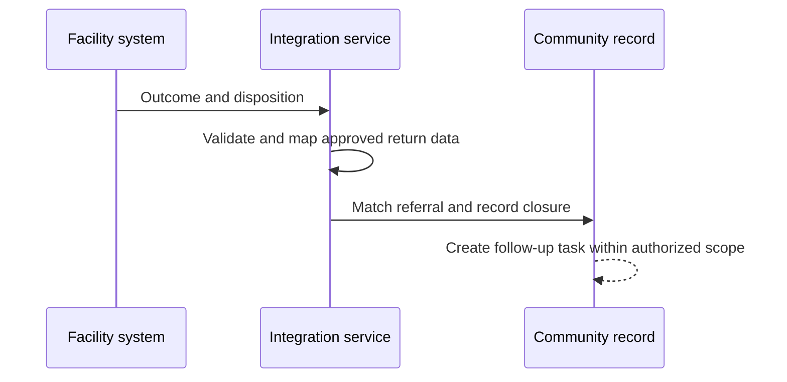

:::info Page details
**Interface ID:** `DCS.INT.REF.02` · **Owner:** OpenFn (proposed) · **Status:** Draft
:::

## Overview

| Field | Value |
|---|---|
| Outcome | The community system receives an approved service outcome, updates referral status, and creates any required follow-up task |
| Pattern | Closed-loop |
| Route | Facility EMR or referral system → integration service → community record. Reference: OpenMRS, OpenFn, eCHIS |
| Trigger | The facility records a qualifying disposition, service outcome, or closure event |
| Used by workflows | [Referral and counter-referral](../workflows/referral-counter-referral.md) |

## Components involved

- [Facility EMR (OpenMRS)](../architecture/components/openmrs.md)
- [Integration orchestration (OpenFn)](../architecture/components/openfn.md)
- [FHIR shared record (HAPI FHIR)](../architecture/components/hapi-fhir.md)

## Sequence

## Preconditions

An originating referral identifier, a matched person, and an approved set of return data elements.

## Processing steps

1. Read the qualifying outcome.
2. Identify the originating referral and person.
3. Transform the approved return data.
4. Update the referral.
5. Create the closure record and follow-up task.
6. Acknowledge processing.

## Mapping

Return only encounter result, disposition, and treatment or follow-up information that policy allows. Full field mappings stay in the mapping repository.

## Reliability

Hold outcomes with no originating referral, an unmatched person, or a disclosure restriction. Detect already closed referrals and duplicate outcomes. Apply a revised facility outcome under the approved correction rule. Do not create a follow-up task when timing is missing and the rule requires it.

## Security

Limit the outcome to the authorized community scope. Do not copy the full facility record.

## Monitoring

Outcomes received, matched referrals, referrals closed, follow-up tasks created, unmatched outcomes, duplicate outcomes, and processing failures.

## Standards & FHIR artifacts

See the [eCHIS FHIR Implementation Guide](https://palladium-group.github.io/datafi-echis-ig/).

## Metadata packages

## Tests

Matched closure creates one follow-up task. No originating referral. Unmatched person. Already closed. Revised outcome. Missing follow-up timing. Disclosure restriction. Duplicate outcome.
