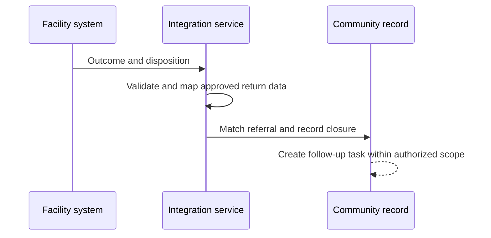
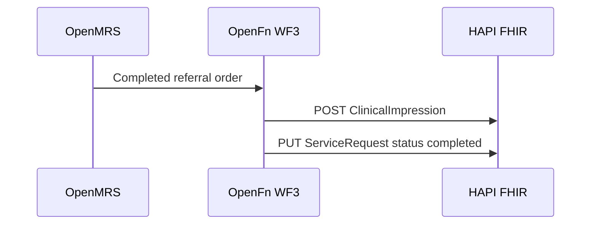

## Overview

| Field | Value |
|---|---|
| Outcome | The community system receives an approved service outcome, updates referral status, and creates any required follow-up task |
| Pattern | Closed-loop |
| Route | Facility EMR or referral system → integration service → community record. Reference: OpenMRS, OpenFn, eCHIS |
| Trigger | The facility records a qualifying disposition, service outcome, or closure event |
| OpenFn workflow | WF3 · OpenMRS to eCHIS |
| Used by workflows | [Referral and counter-referral](../workflows/referral-counter-referral.md) |

## Components involved

- [Facility EMR (OpenMRS)](../architecture/components/openmrs.md)
- [Integration orchestration (OpenFn)](../architecture/components/openfn.md)
- [FHIR shared record (HAPI FHIR)](../architecture/components/hapi-fhir.md)

## Sequence

## Preconditions

An originating referral identifier, a matched person, and an approved set of return data elements.

## Processing steps

1. Read the qualifying outcome.
2. Identify the originating referral and person.
3. Transform the approved return data.
4. Update the referral.
5. Create the closure record and follow-up task.
6. Acknowledge processing.

## Mapping

Return only encounter result, disposition, and treatment or follow-up information that policy allows. Full field mappings stay in the mapping repository.

## Reliability

Hold outcomes with no originating referral, an unmatched person, or a disclosure restriction. Detect already closed referrals and duplicate outcomes. Apply a revised facility outcome under the approved correction rule. Do not create a follow-up task when timing is missing and the rule requires it.

## Security

Limit the outcome to the authorized community scope. Do not copy the full facility record.

## Monitoring

Outcomes received, matched referrals, referrals closed, follow-up tasks created, unmatched outcomes, duplicate outcomes, and processing failures.

## Reference implementation

How OpenFn WF3 implements this interface in the reference eCHIS. Full field mappings are kept in the eCHIS Mapping Specification.

**Trigger:** a referral order in OpenMRS is completed. OpenFn matches it to the originating ServiceRequest through the source-referral observation that [community referral](./community-referral.md) wrote on the encounter.

OpenMRS's FHIR API does not offer Procedure or ClinicalImpression, so OpenFn writes the closure record itself from the matched order.

1. **Create the closure record.** `POST ClinicalImpression` (status `completed`) with the same patient as the referral, the order's discharge time as the date, a link to the ServiceRequest, and the clinician's comment as a note when one exists.
2. **Close the referral.** `PUT` the ServiceRequest with status `completed`. Every other field is sent back unchanged.

### Safeguards

- The referral is closed only after the closure record is saved, so a failed write never leaves a referral marked closed with no outcome.
- The note is left out entirely when the clinician wrote no comment.
- The patient reference comes from the original referral, not from OpenMRS.

## Standards & FHIR artifacts

See the [eCHIS FHIR Implementation Guide](https://palladium-group.github.io/datafi-echis-ig/).

## Metadata packages

- Uses the OpenMRS referral metadata set up for [community referral](./community-referral.md)
- OpenFn WF3 job and credentials

See the [Metadata packages index](../standards/metadata-packages.md).

## Tests

Matched closure creates one follow-up task. No originating referral. Unmatched person. Already closed. Revised outcome. Missing follow-up timing. Disclosure restriction. Duplicate outcome.
