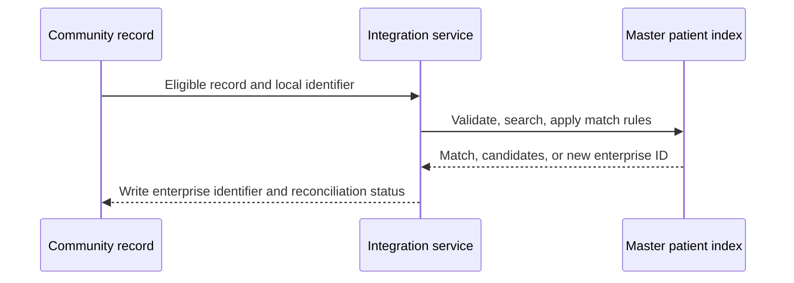

:::info Page details
**Interface ID:** `DCS.INT.ID.01` · **Owner:** OpenFn (proposed) · **Status:** Draft
:::

## Overview

| Field | Value |
|---|---|
| Outcome | A person in the community record is matched to or created in the approved master patient index, and the enterprise identifier is written back |
| Pattern | Transactional |
| Route | Community FHIR server → integration service → master patient index → community FHIR server. Reference: HAPI FHIR, OpenFn, SanteMPI |
| Trigger | A new or changed person record becomes eligible for reconciliation |
| Used by workflows | [Registration and household enrollment](../workflows/registration-household-enrollment.md) |

## Components involved

- [FHIR shared record (HAPI FHIR)](../architecture/components/hapi-fhir.md)
- [Integration orchestration (OpenFn)](../architecture/components/openfn.md)
- [Master patient index (SanteMPI)](../architecture/components/santempi.md)

## Sequence

## Preconditions

Minimum demographics, a stable local identifier and assigning authority, permission to search and create in the index, and an approved match policy.

## Processing steps

1. Read the eligible record.
2. Validate minimum demographics.
3. Search the master patient index.
4. Assess the candidate response.
5. Create a person only when the match policy allows it.
6. Write the identifier and reconciliation status back.
7. Retain audit evidence.

## Mapping

Summary: local identifier and demographics to the index search or create payload; enterprise identifier and reconciliation status back to the community record. Full field mappings stay in the mapping repository.

## Reliability

Use a stable source identifier and assigning authority. Prevent repeated person creation. Hold ambiguous matches. Retry transient failures. Reconcile write-back failures.

## Security

Least-privilege credentials for search and create. Do not log full demographic payloads. Retain audit evidence under the approved retention rule.

## Monitoring

Eligible records, successful matches, new index records, ambiguous matches, failed requests, missing write-backs, and processing latency.

## Standards & FHIR artifacts

See the [eCHIS FHIR Implementation Guide](https://palladium-group.github.io/datafi-echis-ig/) for the person profile and identifier.

## Metadata packages

## Tests

Exact match, no match, multiple candidates, missing required data, index timeout, duplicate replay, unauthorized write, and write-back conflict.
