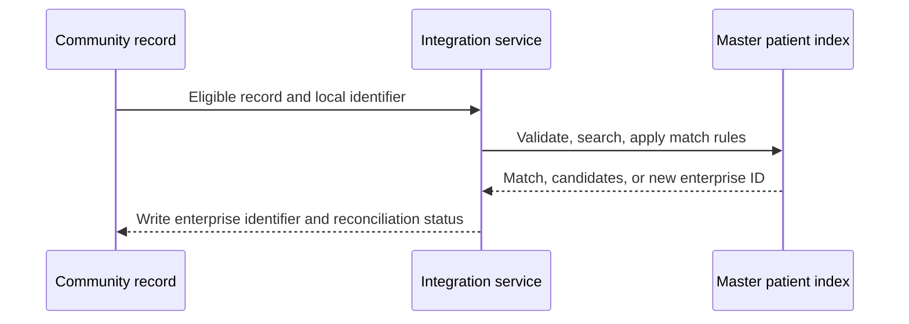
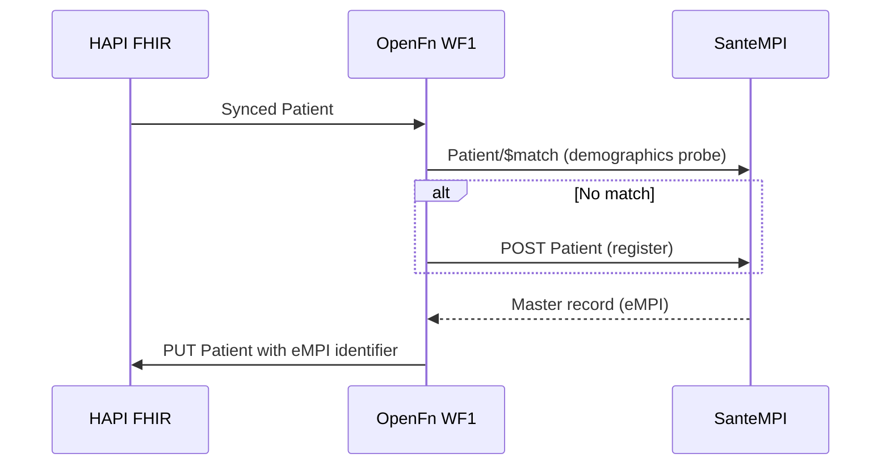

## Overview

| Field | Value |
|---|---|
| Outcome | A person in the community record is matched to or created in the approved master patient index, and the enterprise identifier is written back |
| Pattern | Transactional |
| Route | Community FHIR server → integration service → master patient index → community FHIR server. Reference: HAPI FHIR, OpenFn, SanteMPI |
| Trigger | A new or changed person record becomes eligible for reconciliation |
| OpenFn workflow | WF1 · eCHIS to SanteMPI |
| Used by workflows | [Registration and household enrollment](../workflows/registration-household-enrollment.md) |

## Components involved

- [FHIR shared record (HAPI FHIR)](../architecture/components/hapi-fhir.md)
- [Integration orchestration (OpenFn)](../architecture/components/openfn.md)
- [Master patient index (SanteMPI)](../architecture/components/santempi.md)

## Sequence

## Preconditions

Minimum demographics, a stable local identifier and assigning authority, permission to search and create in the index, and an approved match policy.

## Processing steps

1. Read the eligible record.
2. Validate minimum demographics.
3. Search the master patient index.
4. Assess the candidate response.
5. Create a person only when the match policy allows it.
6. Write the identifier and reconciliation status back.
7. Retain audit evidence.

## Mapping

Summary: local identifier and demographics to the index search or create payload; enterprise identifier and reconciliation status back to the community record. Full field mappings stay in the mapping repository.

## Reliability

Use a stable source identifier and assigning authority. Prevent repeated person creation. Hold ambiguous matches. Retry transient failures. Reconcile write-back failures.

## Security

Least-privilege credentials for search and create. Do not log full demographic payloads. Retain audit evidence under the approved retention rule.

## Monitoring

Eligible records, successful matches, new index records, ambiguous matches, failed requests, missing write-backs, and processing latency.

## Reference implementation

How OpenFn WF1 implements this interface in the reference eCHIS. Full field mappings are kept in the eCHIS Mapping Specification.

**Trigger:** runs on every patient synced to HAPI FHIR. Demographics-only patients are normal; identifiers are optional.

1. **Search.** Send a probe Patient to SanteMPI `Patient/$match` built from the official name, gender, birth date, phone and National ID.
2. **Register (no match only).** `POST /Patient` to SanteMPI with the OpenSRP ID, National ID, record UUID, full name, gender, birth date, active and deceased flags, and phone.
3. **Write back.** Append the eMPI to the HAPI FHIR Patient as a new identifier and tag the record as synced. Runs after a match or a registration.

### Key mappings

| SanteMPI field | eCHIS Patient source | Rule |
|---|---|---|
| `name.given`, `name.family` | `name[use=official]` | Probe uses the first given name. Register keeps the full given array |
| `gender` | `gender` | Already a FHIR gender code |
| `birthDate` | `birthDate` | Already `YYYY-MM-DD` |
| `telecom` (phone) | `telecom[system=phone]` | Omitted when empty |
| National ID | `identifier` typed `id_category` | Omitted when absent, which is the common case |
| OpenSRP ID | Untyped `official` identifier | Assigned the OpenSRP ID system |
| Record UUID | `identifier[use=secondary]` | Carried for cross-reference |
| eMPI (write-back) | SanteMPI master record id | Identifier type `PI` (HL7 v2-0203), text "Enterprise Master Patient ID" |

See [Patient identifiers](../standards/terminology.md#patient-identifiers) for the identifier systems.

### Safeguards

- The eMPI is the key every later workflow matches on. [Community referral](./community-referral.md) and [surveillance](./surveillance-alerts.md) depend on WF1 having run first.
- The write-back appends an identifier. Existing identifiers are not changed.
- Demographic fields are personal data and are kept out of OpenFn run logs. Only constants and code systems are logged.

## Standards & FHIR artifacts

See the [eCHIS FHIR Implementation Guide](https://palladium-group.github.io/datafi-echis-ig/) for the person profile and identifier.

## Metadata packages

- SanteMPI assigning authorities for the OpenSRP ID, record UUID, National ID and eMPI master identifier
- OpenFn WF1 job and credentials

See the [Metadata packages index](../standards/metadata-packages.md).

## Tests

Exact match, no match, multiple candidates, missing required data, index timeout, duplicate replay, unauthorized write, and write-back conflict.
