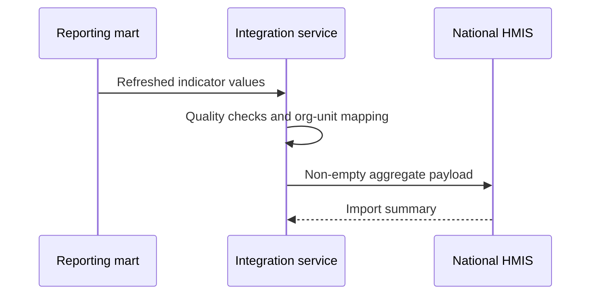
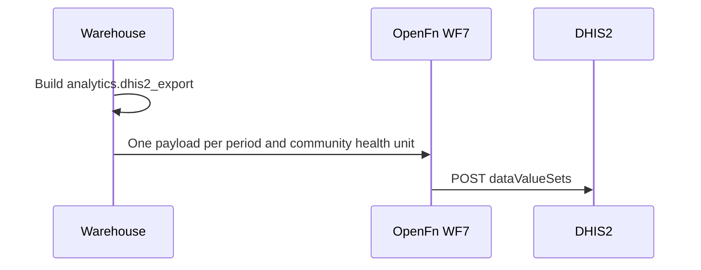

## Overview

| Field | Value |
|---|---|
| Outcome | Approved aggregate values derived from governed individual-level data are submitted by reporting unit and period |
| Pattern | Analytical |
| Route | Governed warehouse or reporting mart → integration service → national HMIS. Reference: analytics warehouse, OpenFn, DHIS2 aggregate |
| Trigger | The reporting period closes, or an approved scheduled run begins |
| OpenFn workflow | WF7 · Warehouse to DHIS2 Aggregate |
| Used by workflows | [Child health and immunization](../workflows/child-health-immunization.md) and other workflows that feed approved indicators |

## Components involved

- [Analytics warehouse](../architecture/components/analytics-warehouse.md)
- [Integration orchestration (OpenFn)](../architecture/components/openfn.md)
- [DHIS2 (Tracker and aggregate)](../architecture/components/dhis2.md)

## Sequence

## Preconditions

Source refresh completed, versioned indicator logic, reporting-unit mappings, and approval where policy requires it.

## Processing steps

1. Verify the source refresh.
2. Calculate values.
3. Apply reporting-unit mappings.
4. Run data-quality checks.
5. Build a non-empty payload.
6. Submit.
7. Retain the import summary.
8. Reconcile rejected values.

## Mapping

Map indicators to data elements and reporting units to organization units. Retain numerator and denominator lineage. Full mappings stay in the mapping repository.

## Reliability

Version the indicator logic. Prevent a duplicate submission for the same period. Control revisions. Require approval where policy dictates.

## Security

Submit aggregates only. Do not include person-level records in this exchange.

## Monitoring

Periods submitted, values accepted, values rejected, unmapped organization units, and reruns.

## Reference implementation

How OpenFn WF7 implements this interface in the reference eCHIS. Full field mappings are kept in the eCHIS Mapping Specification.

- **Source:** the `analytics.dhis2_export` table. The warehouse transformation builds one ready-to-send payload per reporting period and community health unit (CHU).
- **Target:** DHIS2 `dataValueSets` for the **eCHIS Monthly Report** data set (51 indicators).
- **Period** is `YYYYMM` and is passed through unchanged. **Org unit** is the CHU, which is assigned to the data set directly.
- OpenFn passes the data set, period, org unit and values through. The indicator logic lives in the warehouse.

### Safeguards

- Zero and empty values are dropped before posting, so blank indicators never reach DHIS2.

## Standards & FHIR artifacts

Indicators are calculated from governed models fed by [analytics ingestion](./analytics-ingestion.md). Profile definitions remain in the [eCHIS FHIR Implementation Guide](https://palladium-group.github.io/datafi-echis-ig/).

## Metadata packages

- DHIS2 eCHIS Monthly Report data set, its 51 data elements and the CHU org units
- Warehouse `dhis2_export` model
- OpenFn WF7 job and credentials

See the [Metadata packages index](../standards/metadata-packages.md).

## Tests

No activity. Zero value. Late records. Mapped and unmapped organization unit. Revised period. Rejected data element. Partial import. Rerun.
