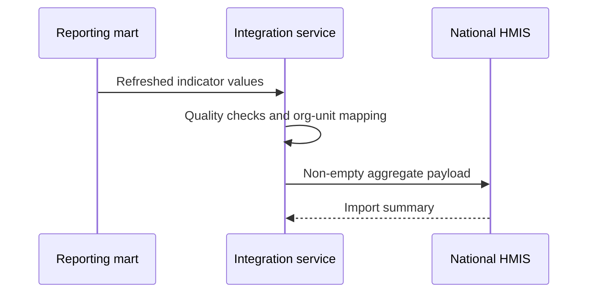

:::info Page details
**Interface ID:** `DCS.INT.REP.01` · **Owner:** OpenFn (proposed) · **Status:** Draft
:::

## Overview

| Field | Value |
|---|---|
| Outcome | Approved aggregate values derived from governed individual-level data are submitted by reporting unit and period |
| Pattern | Analytical |
| Route | Governed warehouse or reporting mart → integration service → national HMIS. Reference: analytics warehouse, OpenFn, DHIS2 aggregate |
| Trigger | The reporting period closes, or an approved scheduled run begins |
| Used by workflows | [Child health and immunization](../workflows/child-health-immunization.md) and other workflows that feed approved indicators |

## Components involved

- [Analytics warehouse](../architecture/components/analytics-warehouse.md)
- [Integration orchestration (OpenFn)](../architecture/components/openfn.md)
- [DHIS2 (Tracker and aggregate)](../architecture/components/dhis2.md)

## Sequence

## Preconditions

Source refresh completed, versioned indicator logic, reporting-unit mappings, and approval where policy requires it.

## Processing steps

1. Verify the source refresh.
2. Calculate values.
3. Apply reporting-unit mappings.
4. Run data-quality checks.
5. Build a non-empty payload.
6. Submit.
7. Retain the import summary.
8. Reconcile rejected values.

## Mapping

Map indicators to data elements and reporting units to organization units. Retain numerator and denominator lineage. Full mappings stay in the mapping repository.

## Reliability

Version the indicator logic. Prevent a duplicate submission for the same period. Control revisions. Require approval where policy dictates.

## Security

Submit aggregates only. Do not include person-level records in this exchange.

## Monitoring

Periods submitted, values accepted, values rejected, unmapped organization units, and reruns.

## Standards & FHIR artifacts

Indicators are calculated from governed models fed by [analytics ingestion](./analytics-ingestion.md). Profile definitions remain in the [eCHIS FHIR Implementation Guide](https://palladium-group.github.io/datafi-echis-ig/).

## Metadata packages

## Tests

No activity. Zero value. Late records. Mapped and unmapped organization unit. Revised period. Rejected data element. Partial import. Rerun.
