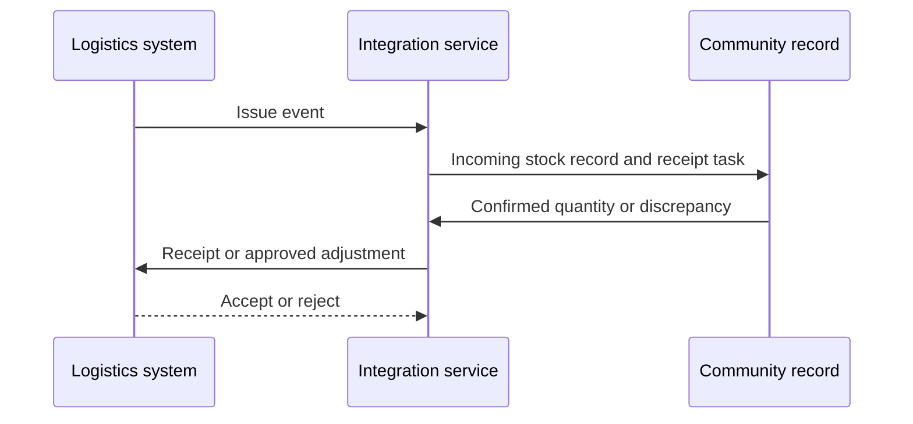

:::info Page details
**Interface ID:** `DCS.INT.SCM.01 / DCS.INT.SCM.02` · **Owner:** OpenFn (proposed) · **Status:** Draft
:::

`DCS.INT.SCM.01` is issue-to-receipt. `DCS.INT.SCM.02` is receipt and adjustment back to the logistics system.

## Overview

| Field | Value |
|---|---|
| Outcome | The community health worker can confirm issued stock, and approved receipt, damage, and expiry transactions are reflected in the logistics system |
| Pattern | Transactional |
| Route | Logistics system ↔ integration service ↔ community record. Reference: OpenLMIS, OpenFn, eCHIS |
| Trigger | Logistics issue event, worker receipt confirmation, or an approved adjustment record |
| Used by workflows | [Community commodity management](../workflows/community-commodity-management.md) |

## Components involved

- [Supply chain (OpenLMIS)](../architecture/components/openlmis.md)
- [Integration orchestration (OpenFn)](../architecture/components/openfn.md)
- [FHIR shared record (HAPI FHIR)](../architecture/components/hapi-fhir.md)

## Sequence

## Preconditions

Identifiers for commodity, lot or batch when used, issuing and receiving locations, worker or stock point, transaction, reason, and source record.

## Processing steps

1. Receive the issue.
2. Create the incoming-stock record and task.
3. Confirm quantity or record a discrepancy.
4. Post the receipt before any downstream adjustment.
5. Reconcile accepted and rejected transactions.

## Mapping

Map commodity, quantity, locations, lot, reason, and source transaction IDs. Full field mappings stay in the mapping repository.

## Reliability

Do not allow negative stock without an approved rule. Prevent duplicate transactions. Retain the source quantity and the destination response. Surface discrepancies for review. Retry rejected transient failures. Do not post an adjustment before the receipt.

## Security

Limit stock credentials to the issuing and receiving locations in scope.

## Monitoring

Issues received, receipts confirmed, discrepancies open, adjustments accepted or rejected, and reconciliation lag.

## Standards & FHIR artifacts

See the [eCHIS FHIR Implementation Guide](https://palladium-group.github.io/datafi-echis-ig/) for commodity profiles.

## Metadata packages

## Tests

Full and partial receipt. Unknown commodity. Invalid location. Duplicate transaction. Adjustment before receipt. Expired batch. Logistics rejection. Retry.
