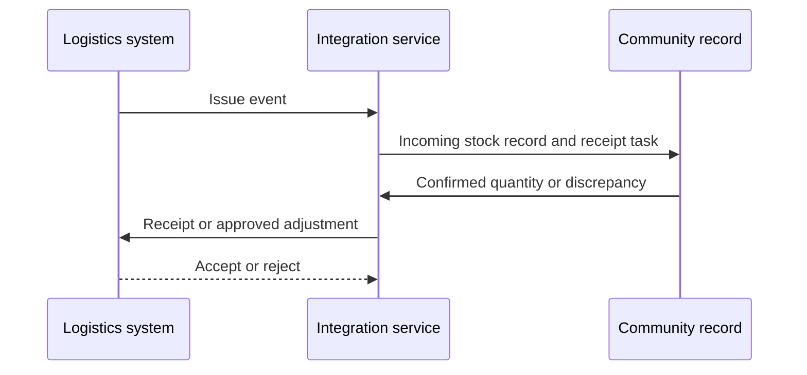
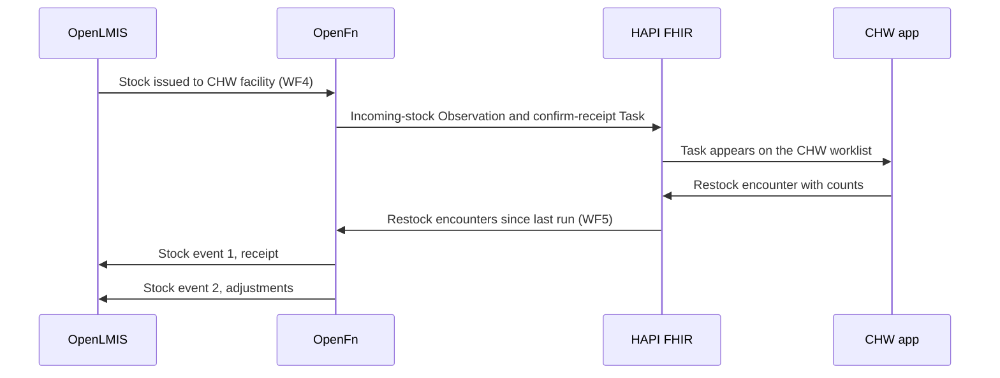

`DCS.INT.SCM.01` is issue-to-receipt. `DCS.INT.SCM.02` is receipt and adjustment back to the logistics system.

## Overview

| Field | Value |
|---|---|
| Outcome | The community health worker can confirm issued stock, and approved receipt, damage, and expiry transactions are reflected in the logistics system |
| Pattern | Transactional |
| Route | Logistics system ↔ integration service ↔ community record. Reference: OpenLMIS, OpenFn, eCHIS |
| Trigger | Logistics issue event, worker receipt confirmation, or an approved adjustment record |
| OpenFn workflow | WF4 · OpenLMIS to eCHIS, and WF5 · eCHIS to OpenLMIS |
| Used by workflows | [Community commodity management](../workflows/community-commodity-management.md) |

## Components involved

- [Supply chain (OpenLMIS)](../architecture/components/openlmis.md)
- [Integration orchestration (OpenFn)](../architecture/components/openfn.md)
- [FHIR shared record (HAPI FHIR)](../architecture/components/hapi-fhir.md)

## Sequence

## Preconditions

Identifiers for commodity, lot or batch when used, issuing and receiving locations, worker or stock point, transaction, reason, and source record.

## Processing steps

1. Receive the issue.
2. Create the incoming-stock record and task.
3. Confirm quantity or record a discrepancy.
4. Post the receipt before any downstream adjustment.
5. Reconcile accepted and rejected transactions.

## Mapping

Map commodity, quantity, locations, lot, reason, and source transaction IDs. Full field mappings stay in the mapping repository.

## Reliability

Do not allow negative stock without an approved rule. Prevent duplicate transactions. Retain the source quantity and the destination response. Surface discrepancies for review. Retry rejected transient failures. Do not post an adjustment before the receipt.

## Security

Limit stock credentials to the issuing and receiving locations in scope.

## Monitoring

Issues received, receipts confirmed, discrepancies open, adjustments accepted or rejected, and reconciliation lag.

## Reference implementation

How OpenFn WF4 and WF5 implement this interface in the reference eCHIS. Full field mappings are kept in the eCHIS Mapping Specification.

### WF4: issue to receipt task

For each issued stock line item, OpenFn creates two linked resources in HAPI FHIR:

- An **incoming-stock Observation** (status `preliminary`, category SNOMED `386452003` Supply management) for the commodity, with the issued quantity, dispensing unit and a note naming the source warehouse and issue document.
- A **confirm-stock-receipt Task** (status `requested`) for the CHW, pointing at that Observation, with the expected quantity, commodity, source warehouse and destination facility as inputs. Its group identifier is the OpenLMIS issue document number.

Both carry the OpenLMIS line-item id as their identifier, and the eCHIS organisation tag so they sync to the right team.

### WF5: receipt and adjustments

OpenFn reads restock Encounters (with their Observations) changed since the last run. One encounter covers one commodity. It posts two stock events to OpenLMIS at the CHW facility:

1. **Receipt**: the full restocked quantity, received from the central warehouse.
2. **Adjustments**: damage and expiry, each with its OpenLMIS reason.

| eCHIS movement | Effect | Sent to OpenLMIS as |
|---|---|---|
| `restocked` | Addition | Receipt event |
| `damage` | Subtraction | Adjustment, reason Damage |
| `expiry` | Subtraction | Adjustment, reason Expired |
| `donation`, `under-reporting`, `over-reporting` | Addition or subtraction | Not sent. No OpenLMIS reason is configured |
| `physical-count-soh` | Count | Not sent. Belongs to a physical inventory |
| `balance-before-restock`, `balance-after-restock` | Snapshot | Not sent. The closing balance is used to check OpenLMIS afterwards |
| `incoming-stock` | WF4 output | Excluded, or the receipt would count twice |

### Safeguards

- **Receipt first, adjustments second.** OpenLMIS rejects a debit larger than stock on hand. If only the adjustment fails, the facility is left overstated.
- The document number is built from the encounter id with `-RCV` and `-ADJ` suffixes, so the second event is not treated as a duplicate.
- Quantities are always sent as positive numbers. The reason sets the direction.
- Zero quantities, records with undefined organisation tags, and commodities with no OpenLMIS product are skipped, not failed.
- Branch on `Observation.code` only. eCHIS labels movement categories inconsistently.

## Standards & FHIR artifacts

See the [eCHIS FHIR Implementation Guide](https://palladium-group.github.io/datafi-echis-ig/) for commodity profiles.

## Metadata packages

- OpenLMIS products tagged with their eCHIS commodity id (11 mapped in the reference)
- OpenLMIS program, CHW facilities, central warehouse node and the Damage and Expired reasons
- eCHIS commodity Groups and the `incoming-stock` and `confirm-stock-receipt` codes
- OpenFn WF4 and WF5 jobs and credentials

See the [Metadata packages index](../standards/metadata-packages.md).

## Tests

Full and partial receipt. Unknown commodity. Invalid location. Duplicate transaction. Adjustment before receipt. Expired batch. Logistics rejection. Retry.
