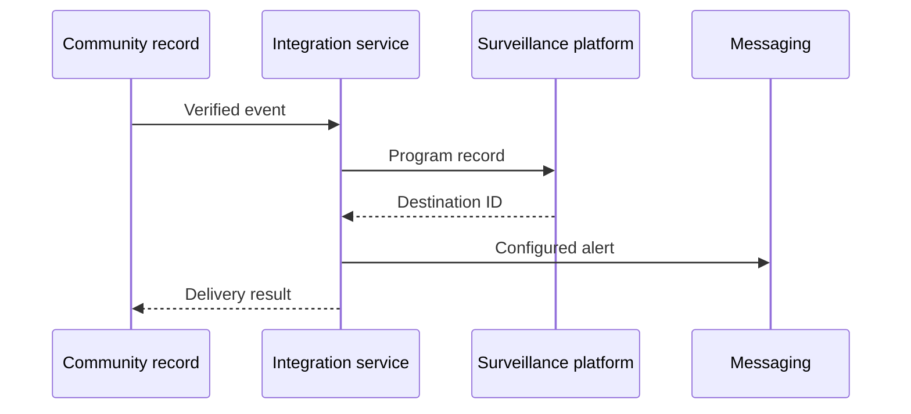

:::info Page details
**Interface ID:** `DCS.INT.SURV.01 / DCS.INT.SURV.02` · **Owner:** OpenFn (proposed) · **Status:** Draft
:::

`DCS.INT.SURV.01` exchanges an adverse event. `DCS.INT.SURV.02` exchanges a verified community signal.

## Overview

| Field | Value |
|---|---|
| Outcome | Qualifying and verified records are exchanged with the surveillance platform, and configured alerts reach approved recipients |
| Pattern | Transactional |
| Route | Community record → integration service → surveillance platform, with an optional messaging service. Reference: eCHIS, OpenFn, DHIS2 Tracker, RapidPro |
| Trigger | An approved event state, such as verified or ready for exchange |
| Used by workflows | [Community event-based surveillance](../workflows/community-event-based-surveillance.md) |

## Components involved

- [FHIR shared record (HAPI FHIR)](../architecture/components/hapi-fhir.md)
- [Integration orchestration (OpenFn)](../architecture/components/openfn.md)
- [DHIS2 (Tracker and aggregate)](../architecture/components/dhis2.md)
- [Messaging (RapidPro)](../architecture/components/rapidpro.md)

## Sequence

## Preconditions

Verified or otherwise approved event state, organization-unit mapping, and tracked-entity rules when the surveillance platform requires them.

## Processing steps

1. Validate the event and metadata.
2. Resolve the organization unit and tracked entity when required.
3. Create or update the program record.
4. Store destination IDs.
5. Send the configured alert.
6. Retain the delivery result.

## Mapping

Map the minimum surveillance payload and option codes. Full field mappings stay in the mapping repository.

## Reliability

Reject invalid option codes and missing organization mappings. Detect duplicate events. Replay safely. Apply a revised verification status under the approved correction rule. Record alert failure separately from event acceptance.

## Security

Use the minimum necessary alert content. Do not put sensitive personal data in messages unless that content is explicitly approved. Apply recipient and retention rules.

## Monitoring

Events submitted, accepted, rejected, alerts delivered, alert failures, and revised verifications.

## Standards & FHIR artifacts

See the [eCHIS FHIR Implementation Guide](https://palladium-group.github.io/datafi-echis-ig/) for surveillance profiles.

## Metadata packages

## Tests

New and existing tracked entity. Missing organization mapping. Invalid option code. Duplicate event. Rejected payload. Alert failure. Replay. Revised verification status.
