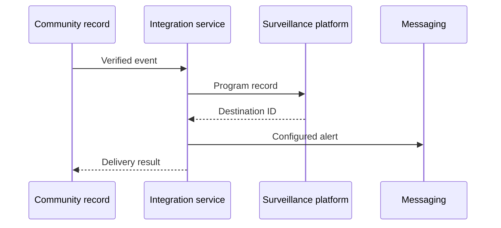
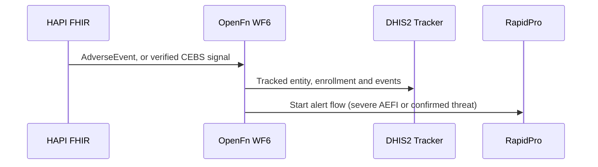

`DCS.INT.SURV.01` exchanges an adverse event. `DCS.INT.SURV.02` exchanges a verified community signal.

## Overview

| Field | Value |
|---|---|
| Outcome | Qualifying and verified records are exchanged with the surveillance platform, and configured alerts reach approved recipients |
| Pattern | Transactional |
| Route | Community record → integration service → surveillance platform, with an optional messaging service. Reference: eCHIS, OpenFn, DHIS2 Tracker, RapidPro |
| Trigger | An approved event state, such as verified or ready for exchange |
| OpenFn workflow | WF6 · eCHIS to DHIS2 Tracker, with RapidPro |
| Used by workflows | [Community event-based surveillance](../workflows/community-event-based-surveillance.md) |

## Components involved

- [FHIR shared record (HAPI FHIR)](../architecture/components/hapi-fhir.md)
- [Integration orchestration (OpenFn)](../architecture/components/openfn.md)
- [DHIS2 (Tracker and aggregate)](../architecture/components/dhis2.md)
- [Messaging (RapidPro)](../architecture/components/rapidpro.md)

## Sequence

## Preconditions

Verified or otherwise approved event state, organization-unit mapping, and tracked-entity rules when the surveillance platform requires them.

## Processing steps

1. Validate the event and metadata.
2. Resolve the organization unit and tracked entity when required.
3. Create or update the program record.
4. Store destination IDs.
5. Send the configured alert.
6. Retain the delivery result.

## Mapping

Map the minimum surveillance payload and option codes. Full field mappings stay in the mapping repository.

## Reliability

Reject invalid option codes and missing organization mappings. Detect duplicate events. Replay safely. Apply a revised verification status under the approved correction rule. Record alert failure separately from event acceptance.

## Security

Use the minimum necessary alert content. Do not put sensitive personal data in messages unless that content is explicitly approved. Apply recipient and retention rules.

## Monitoring

Events submitted, accepted, rejected, alerts delivered, alert failures, and revised verifications.

## Reference implementation

How OpenFn WF6 implements this interface in the reference eCHIS. It covers two programs, adverse events following immunization (AEFI) and community event-based surveillance (CEBS). Full field mappings are kept in the eCHIS Mapping Specification.

### AEFI

- **Source:** AdverseEvent resources, with the suspected Immunization included.
- **DHIS2:** a Person tracked entity enrolled in the AEFI Reporting program, with one AEFI Report event.
- **Person attributes:** name, birth date, gender, and phone, National ID and eMPI when present.
- **Event values:** vaccine name (from the Immunization's vaccine text, not its code), reaction start date, severity, whether the patient was referred, and whether the form was completed.
- **Alert:** severe cases start a RapidPro SMS flow.

| AEFI severity (SNOMED) | DHIS2 option |
|---|---|
| 255604002 | mild |
| 6736007 | moderate |
| 24484000 | severe |

### CEBS

- **Trigger:** a supervisor completes the verify-signal Task. OpenFn reads the signal Observation it points at.
- **DHIS2:** a CEBS Signal tracked entity (not a person) enrolled in CEBS Signal Surveillance, with two events: the VHT Signal Report and the Supervisor Verification.
- **VHT report:** signal type, description, VHT name, village and phone, GPS position and whether the person is in the VHT's area. GPS and area come from the QuestionnaireResponse.
- **Supervisor verification:** method, description, whether a threat exists, people ill and dead, animals involved and affected, threat start date, date the facility was informed, animal health referral, and information sources.
- **Alert:** confirmed threats start the RapidPro CEBS Confirmed Threat Alert flow to the CHEW's phone, with the signal id, location and threat summary.

| eCHIS signal type | DHIS2 option |
|---|---|
| `fever-with-bleeding-or-yellow-or-red-eyes` | `fever-with-bleeding` |
| `dog-or-wild-animal-bite` | `dog-wild-animal-bite` |
| `unexplained-rash-with-fever-and-weakness` | `unexplained-rash` |
| `abnormal-change-in-water` | `abnormal-water-change` |
| `animal-sudden-death-or-strange-behavior` | `animal-sudden-death` |
| `abrupt-climate-event` | `abrupt-climate-event` |
| `other-public-health-threat` | `other-public-health-threat` |

Signal status `final` means a threat exists. `cancelled` means it does not. Animal types and information sources are sent as comma-separated option codes.

### Safeguards

- The DHIS2 org unit comes from the eCHIS organisation tag through a lookup table.
- Optional attributes such as National ID, eMPI and phone are left out when empty.
- RapidPro is started by OpenFn as part of WF6, not by DHIS2.

## Standards & FHIR artifacts

See the [eCHIS FHIR Implementation Guide](https://palladium-group.github.io/datafi-echis-ig/) for surveillance profiles.

## Metadata packages

- DHIS2 AEFI Reporting and CEBS Signal Surveillance programs, their tracked entity types, stages, data elements and option sets
- Org unit lookup from eCHIS organisation to DHIS2 org unit
- RapidPro severe-AEFI and CEBS Confirmed Threat Alert flows
- OpenFn WF6 job and credentials

See the [Metadata packages index](../standards/metadata-packages.md).

## Tests

New and existing tracked entity. Missing organization mapping. Invalid option code. Duplicate event. Rejected payload. Alert failure. Replay. Revised verification status.
