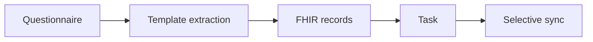

The [Data.FI Reference eCHIS FHIR Implementation Guide](https://palladium-group.github.io/datafi-echis-ig/) is the computable contract. It is the authoritative source for profiles, extensions, value sets, code systems, search parameters, examples, and design notes. These pages explain implementation decisions and where each standard is used. They link into the Implementation Guide rather than copying it.

## How eCHIS produces FHIR records

## Design pillars

| Pillar | What it means |
|---|---|
| Template extraction | Each form carries its output resources as templates, filled from the answers on submit |
| No care plans | Each form creates the next Task directly. See [Scheduled community visit](../workflows/scheduled-community-visit.md) |
| IPS-aligned | Immunizations, vital signs and pregnancy data derive from International Patient Summary profiles. See [IPS alignment](./ips-alignment.md) |
| Selective sync | A sync-scope tag marks what the device needs and what is for analytics only |

## Profiles

| Profile | Based on | Role |
|---|---|---|
| eCHIS Household | Group | The household (SNOMED 35359004). Members, GPS location and care hang off it |
| eCHIS Patient | Patient | A household member or client |
| eCHIS Visit Encounter | Encounter | One per form submission, class home health |
| eCHIS Observation | Observation | A general clinical finding |
| eCHIS Program Condition | Condition | Programme enrolment: pregnancy, postpartum, family planning, HIV, TB, disability |
| eCHIS Task | Task | The next to-do in the schedule |
| eCHIS Service Request (Referral) | ServiceRequest | A referral to a facility (SNOMED 3457005) |
| eCHIS Procedure | Procedure | Treatment given during a visit (SNOMED 18629005) |
| eCHIS Immunization | IPS Immunization | A vaccine dose, coded with CVX |
| eCHIS Baby Weight | Body weight vital sign | Baby weight at a PNC visit (LOINC 29463-7) |
| eCHIS Estimated Delivery Date | IPS pregnancy EDD | LOINC 11778-8 |
| eCHIS Pregnancy Status | IPS pregnancy status | LOINC 82810-3 |
| eCHIS Pregnancy Outcome | IPS pregnancy outcome | Live births, LOINC 11636-8 |
| eCHIS Commodity | Group | A stock item (SNOMED 386452003) |
| eCHIS Stock-out Flag | Flag | Raised when a commodity reaches zero (SNOMED 419182006) |
| eCHIS Surveillance Observation | Observation | A CEBS signal, death report or AFP screen |
| eCHIS Surveillance Task | Task | A supervisor verification or approval |

Full definitions are in the [Implementation Guide artifacts](https://palladium-group.github.io/datafi-echis-ig/artifacts.html).

See [Terminology](./terminology.md), [IPS alignment](./ips-alignment.md) and [Metadata packages](./metadata-packages.md).
