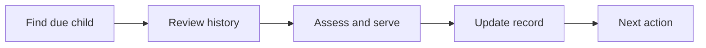

:::info Page details
**Workflow ID:** `DCS.MNCH.CH` (proposed) · **Owner:** Ona (proposed) · **Status:** Draft
:::

## Objective

Identify children due for routine services, review available history, support community-level screening and counselling, record services within scope, refer when required, and schedule the next contact.

## Process header

| Field | Value |
|---|---|
| Trigger | A child is due by age, history, task schedule, or catchment assignment |
| End state | Service within scope recorded, referral created when required, and the next task scheduled |
| Primary persona | Community health worker |
| Supporting actors | Caregiver, child, supervisor, facility |
| Locations | Household and community |
| Works offline? | Yes, using history available on the device |

## Process

## Activities

| ID | Activity | Actor | System action | Data created or reused |
|---|---|---|---|---|
| DCS.MNCH.CH.01 | Find due child | Community health worker | Select by age, history, task schedule, and catchment | Due task, child record |
| DCS.MNCH.CH.02 | Review history | Community health worker | Show immunization, growth, prior illness, referrals, and contraindication data available to the worker | History available on the device |
| DCS.MNCH.CH.03 | Assess and serve | Community health worker | Present approved screening, counselling, community treatment, or referral within scope of practice | Screening and counselling |
| DCS.MNCH.CH.04 | Update record | System | Create observations, service records, commodity use, and referral as applicable | Service record |
| DCS.MNCH.CH.05 | Next action | System | Calculate the due service, create the task, and synchronize records | Next due date |

## Clinical content boundary

Specify where the system invokes approved clinical content and decision logic. Do not invent clinical rules. Each rule should identify its source, approving authority, version, effective date, and linked test cases.

## Decision support

| ID | Trigger | Rule | Output | Approved by |
|---|---|---|---|---|
| DCS.MNCH.CH.DT.01 | Assessment | Country-approved screening or referral rule | Service within scope, or referral | Clinical authority |
| DCS.MNCH.CH.DT.02 | Record update | Approved next-service calculation | Successor task | Program authority |

## Integrations

- [Community referral to facility](../integrations/community-referral.md)
- [Routine aggregate reporting](../integrations/routine-reporting.md)

## Standards & FHIR artifacts

See the [eCHIS FHIR Implementation Guide](https://palladium-group.github.io/datafi-echis-ig/) for immunization and related observation profiles.

## Metadata packages

## Tests

Due child found from schedule. History limited to what the worker may see. Service outside scope blocked. Referral created from an approved rule. Next task calculated once. Aggregate report uses the governed indicator, not a local count.
