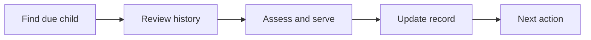

:::info Page details
**Workflow ID:** `DCS.MNCH.CH` (proposed) · **Owner:** Ona (proposed) · **Status:** Draft
:::

## Objective

Identify children due for routine services, review available history, support community-level screening and counselling, record services within scope, refer when required, and schedule the next contact.

## Process

## Activities

## Decision support

## Integrations

- [Community referral to facility](../integrations/community-referral.md)
- [Routine aggregate reporting](../integrations/routine-reporting.md)

## Standards & FHIR artifacts

See the [eCHIS FHIR Implementation Guide](https://palladium-group.github.io/datafi-echis-ig/).

## Metadata packages

## Tests
