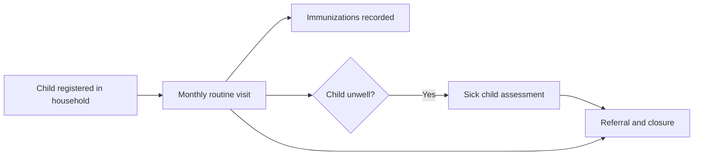

## Objective

Visit every child under five monthly, track immunizations, vitamin A and deworming, assess sick children using WHO IMCI, and refer when needed. The app invokes approved clinical content. It does not invent clinical rules.

## How it works

1. Children under five join the Children register when they are added to a household.
2. A monthly **Child Routine visit** task appears. It can only be recorded when due or overdue.
3. Vaccines are recorded from the child's profile.
4. A sick child is assessed with **Sick assessment** from the profile menu.

## What the CHW records

| Form | Records |
|---|---|
| Child routine visit | How the child is feeling, vaccine card, whether immunizations are up to date, MUAC, swelling, vitamin A (from 6 months), deworming (from 12 months) |
| Immunizations | Vaccines given and their dates, ticked from the child's profile: BCG, OPV 0 to 3, Penta 1 to 3, Rota 1 to 3, IPV, MR 1 and 2 |
| Sick child assessment | Danger signs, main symptoms (cough or difficult breathing, diarrhoea, fever), pre-referral treatment, referral |
| Referral closure | Whether the child reached the facility, the action taken, follow-up |

**Sick child danger signs:** unable to drink or breastfeed, vomiting everything, convulsions (recent or now), lethargic or unconscious, chest in-drawing, yellow eyes or hands, blood in stool.

## Referral triggers

| When | Trigger |
|---|---|
| Routine visit | Child unwell (go to sick child assessment), immunizations not up to date, red or yellow MUAC, swelling |
| Sick child assessment | Any danger sign, any severe classification, or any sick child under 2 months: urgent referral |

See [Referral and counter-referral](./referral-counter-referral.md).

## Related surveillance

- **AFP screening.** A positive acute flaccid paralysis screen goes to the [supervisor app](../architecture/components/supervisor-app.md) for approval.
- **AEFI.** Adverse events following immunization are reported to DHIS2 through [surveillance and alerts](../integrations/surveillance-alerts.md).

## What the system creates

| Form | FHIR records |
|---|---|
| Routine visit | Growth, MUAC, vitamin A and deworming observations, a referral when triggered, the next visit task |
| Immunization | An Immunization per dose, coded with CVX |
| Sick child assessment | Danger signs and classifications, treatment given, a referral when indicated, a follow-up task |

## Integrations

- [Community referral to facility](../integrations/community-referral.md) (referral type `child`)
- [Surveillance and configured alerts](../integrations/surveillance-alerts.md) (AEFI)
- [Routine aggregate reporting](../integrations/routine-reporting.md)

## Standards & FHIR artifacts

eCHIS Immunization (IPS-aligned), Observation, Service Request (Referral), Procedure and Task profiles. Details in the Implementation Guide [integrated care](https://palladium-group.github.io/datafi-echis-ig/integrated-care.html) and [immunization](https://palladium-group.github.io/datafi-echis-ig/immunization.html) pages.

## Metadata packages

- Child health and immunization questionnaires, the child register config and scheduling definitions

See the [Metadata packages index](../standards/metadata-packages.md).

