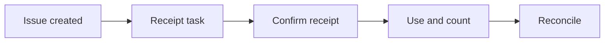

:::info Page details
**Workflow ID:** `DCS.SCM.CHW` (proposed) · **Owner:** Ona (proposed) · **Status:** Draft
:::

## Objective

Maintain an accountable view of commodities held by community workers, confirm issues and receipts, record consumption and adjustments, and exchange approved stock transactions with the logistics system.

## Process header

| Field | Value |
|---|---|
| Trigger | A central or facility system records stock issued to a community health worker |
| End state | Receipt confirmed or discrepancy recorded, consumption and adjustments posted, and eligible transactions reconciled with the logistics system |
| Primary persona | Community health worker |
| Supporting actors | Storekeeper, supervisor, logistics system |
| Locations | Community stock point and facility store |
| Works offline? | Receipt confirmation and counts can be offline. Exchange runs when the transaction is approved |

## Process

## Activities

| ID | Activity | Actor | System action | Data created or reused |
|---|---|---|---|---|
| DCS.SCM.CHW.01 | Receive issue | Logistics system | Record stock issued to the worker | Issue transaction, commodity, quantity, locations |
| DCS.SCM.CHW.02 | Create receipt task | System | Create an incoming-stock record and a confirmation task | Receipt task |
| DCS.SCM.CHW.03 | Confirm receipt | Community health worker | Confirm quantity received or record a discrepancy | Receipt or discrepancy |
| DCS.SCM.CHW.04 | Use and count | Community health worker | Record service consumption, physical count, damage, expiry, and adjustments | Stock movements |
| DCS.SCM.CHW.05 | Reconcile | System | Exchange eligible transactions and surface mismatches | Destination response |

Post the receipt before downstream adjustments. Do not allow negative stock unless an approved rule says so.

## Decision support

| ID | Trigger | Rule | Output | Approved by |
|---|---|---|---|---|
| DCS.SCM.CHW.DT.01 | Receipt | Quantity matches the issue, or a discrepancy is recorded | Confirmed receipt or review task | Logistics authority |
| DCS.SCM.CHW.DT.02 | Adjustment | Approved reason, and receipt already posted | Adjustment accepted or rejected | Logistics authority |

## Integrations

- [Supply issue, receipt and adjustment](../integrations/supply-issue-receipt.md)

## Standards & FHIR artifacts

See the [eCHIS FHIR Implementation Guide](https://palladium-group.github.io/datafi-echis-ig/) for commodity and stock-out profiles.

## Metadata packages

## Tests

Full and partial receipt. Unknown commodity. Discrepancy held for review. Adjustment before receipt blocked. Duplicate transaction prevented. Reconciliation of accepted and rejected transactions.
