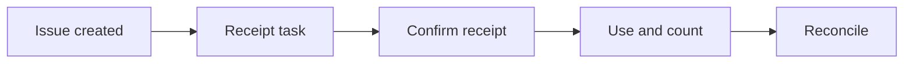

:::info Page details
**Workflow ID:** `DCS.SCM.CHW` (proposed) · **Owner:** Ona (proposed) · **Status:** Draft
:::

## Objective

Maintain an accountable view of commodities held by community workers, confirm issues and receipts, record consumption and adjustments, and exchange approved stock transactions with the logistics system.

## Process

## Activities

## Decision support

## Integrations

- [Supply issue, receipt and adjustment](../integrations/supply-issue-receipt.md)

## Standards & FHIR artifacts

See the [eCHIS FHIR Implementation Guide](https://palladium-group.github.io/datafi-echis-ig/).

## Metadata packages

## Tests
