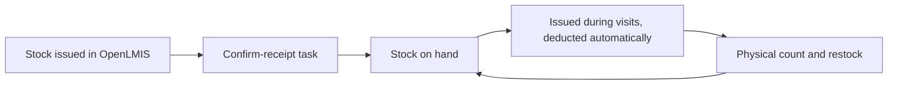

## Objective

Give the CHW an accurate view of the commodities they hold, so they can serve clients and request restocks before running out.

## How it works

1. The **Inventory** register lists each commodity with its stock on hand and the date of its last physical count.
2. Commodities issued during visits are deducted automatically. Each commodity's usage history is read-only.
3. The CHW records a **physical count and restock**, from the register or the commodity profile.

## What the CHW records

| Field | Notes |
|---|---|
| Current stock balance | Calculated by the app, not editable |
| Damaged stock | |
| Expired stock | |
| Stock on hand | The physical count, before any restock |
| Adjust stock by | Shown when the count differs from the balance. A reason and quantity for each difference, for example over-reporting |
| Quantity restocked | Received from the supervisor |

Commodities include ORS, zinc, artesunate, malaria treatment, malaria RDTs, and family planning commodities (oral pills, condoms, cycle beads, emergency contraceptives).

## What the system creates

| Event | FHIR records |
|---|---|
| Count or restock | A new current balance per commodity, closing the previous one |
| Stock reaches zero | A stock-out Flag (SNOMED 419182006) |
| Stock issued in OpenLMIS | An incoming-stock Observation and a confirm-receipt Task |

## Integrations

- [Supply issue, receipt and adjustment](../integrations/supply-issue-receipt.md)
- [Routine aggregate reporting](../integrations/routine-reporting.md) (commodity stock-outs)

## Standards & FHIR artifacts

eCHIS Commodity and Stock-out Flag profiles. Details in the [Implementation Guide integrated care page](https://palladium-group.github.io/datafi-echis-ig/integrated-care.html).

## Metadata packages

- The physical count and restock form, the inventory register and profile configs, and one commodity Group per item

See the [Metadata packages index](../standards/metadata-packages.md).
