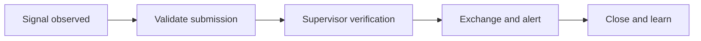

:::info Page details
**Workflow ID:** `DCS.SURV.CEBS` (proposed) · **Owner:** Ona (proposed) · **Status:** Draft
:::

## Objective

Capture a community signal, apply an approved verification process, escalate qualifying events, exchange the minimum required information with the surveillance platform, and maintain closure status.

## Process header

| Field | Value |
|---|---|
| Trigger | A community health worker observes a signal |
| End state | Signal verified, rejected, or marked duplicate; qualifying events exchanged; closure and feedback recorded |
| Primary persona | Community health worker |
| Supporting actors | Supervisor, surveillance officer |
| Locations | Community |
| Works offline? | Capture can be offline. Exchange and alerts run when the approved event state is reached and connectivity allows |

## Process

## Activities

| ID | Activity | Actor | System action | Data created or reused |
|---|---|---|---|---|
| DCS.SURV.CEBS.01 | Record signal | Community health worker | Capture person, event, time, place, description, and immediate action | Signal report |
| DCS.SURV.CEBS.02 | Validate submission | System | Check completeness, duplicate risk, location, and reporter assignment | Validation result |
| DCS.SURV.CEBS.03 | Verify | Supervisor | Record verified, rejected, duplicate, or needs follow-up | Verification status |
| DCS.SURV.CEBS.04 | Exchange and alert | System | Submit the verified event and send the configured notification | Destination identifier, alert result |
| DCS.SURV.CEBS.05 | Close and learn | Supervisor | Track acknowledgment, investigation status, outcome, and feedback to the community team | Closure status |

## Decision support

| ID | Trigger | Rule | Output | Approved by |
|---|---|---|---|---|
| DCS.SURV.CEBS.DT.01 | Submission | Completeness, duplicate risk, and assignment | Accept for review or return | Surveillance authority |
| DCS.SURV.CEBS.DT.02 | Supervisor review | Approved verification criteria | Verified, rejected, duplicate, or needs follow-up | Surveillance authority |

## Integrations

- [Surveillance and configured alerts](../integrations/surveillance-alerts.md)

## Standards & FHIR artifacts

See the [eCHIS FHIR Implementation Guide](https://palladium-group.github.io/datafi-echis-ig/) for surveillance observation and task profiles.

## Metadata packages

## Tests

Incomplete signal returned. Duplicate suspected. Supervisor rejects, verifies, or requests follow-up. Only verified events are exchanged. Alert uses the minimum approved content. Closure records investigation outcome and community feedback.
