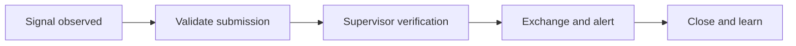

:::info Page details
**Workflow ID:** `DCS.SURV.CEBS` (proposed) · **Owner:** Ona (proposed) · **Status:** Draft
:::

## Objective

Capture a community signal, apply an approved verification process, escalate qualifying events, exchange the minimum required information with the surveillance platform, and maintain closure status.

## Process

## Activities

## Decision support

## Integrations

- [Surveillance and configured alerts](../integrations/surveillance-alerts.md)

## Standards & FHIR artifacts

See the [eCHIS FHIR Implementation Guide](https://palladium-group.github.io/datafi-echis-ig/).

## Metadata packages

## Tests
