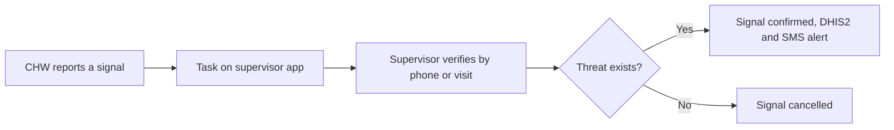

## Objective

Pick up public health threats early, before cases reach a facility. The CHW reports unusual events from the community, the supervisor verifies them, and confirmed threats reach the district surveillance team. Signals cover human, animal and environmental hazards (One Health).

## How it works

1. The CHW opens the signal report from **CEBS New Signals**. Supervisors can also report a signal themselves.
2. A verification task appears straight away under **CEBS Incoming Signals** on the [supervisor app](../architecture/components/supervisor-app.md).
3. The supervisor verifies the signal and records whether the threat exists.
4. Confirmed signals go to DHIS2 Tracker for the district team, and an SMS alert is sent. Handled signals move to **CEBS History**.

## What is recorded

| Form | Records |
|---|---|
| CHW signal report | Whether an unusual event happened in the past 30 days, signal type (one per report), whether it is in the CHW's area, description, GPS location, CHW name, phone and area |
| Supervisor verification | Method (phone call or home visit), description, matching signal type, threat start time, people ill and dead, animals involved (types, affected, dead), information sources, whether the threat still exists, date the facility was informed, animal health referral, risk classification (low, medium, high) |

## Signal types

| Signal | Example |
|---|---|
| Two or more people suddenly falling seriously ill or dying | Cluster of unexplained fever deaths |
| Fever with signs of bleeding or red or yellow eyes | Suspected viral haemorrhagic fever |
| Unexplained rash with fever and body weakness | Suspected mpox |
| Sudden or unexplained animal death or strange behaviour | Livestock deaths, aggression, drooling |
| Person bitten by a dog or wild animal | Suspected rabies exposure |
| Abnormal change in drinking water | Contamination, algae bloom, pollution |
| Abrupt climate-related event | Flooding, heatwave, drought |
| Any other public health threat | Locust infestation, civil emergency |

## What the system creates

| Step | FHIR records |
|---|---|
| CHW report | A preliminary signal Observation anchored to the place (not a patient), the event location, and a verify-signal Task for the supervisor |
| Supervisor verification | The signal becomes final (threat exists) or cancelled. The Task is completed. Risk, people affected and animals affected are recorded |

## Integrations

- [Surveillance and configured alerts](../integrations/surveillance-alerts.md)

## Standards & FHIR artifacts

eCHIS Surveillance Observation and Surveillance Task profiles, and the CEBS signal type code system. Details in the [Implementation Guide CEBS page](https://palladium-group.github.io/datafi-echis-ig/cebs.html).

## Metadata packages

- CHW signal report and supervisor verification forms, the CEBS registers on both apps, and the CEBS code systems

See the [Metadata packages index](../standards/metadata-packages.md).

