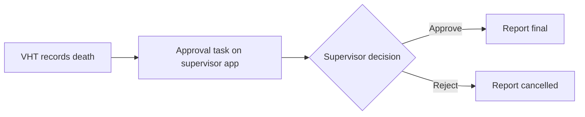

## Objective

Record deaths in the community for civil registration and vital statistics. Each report is approved by a supervisor before it counts towards mortality figures.

## How it works

1. From a household member's profile, the VHT chooses **Death report**, fills in the form and confirms. This cannot be undone.
2. The member shows greyed out and deceased in the household, and their tasks are withdrawn.
3. The report appears under **Approval Tasks** on the [supervisor app](../architecture/components/supervisor-app.md).
4. The supervisor approves or rejects it.

## What is recorded

| Who | Records |
|---|---|
| VHT | Date and cause of death, whether it was reported to the area registration officer |
| Supervisor | Whether it was reported to the area registration officer (the VHT's answer is kept too), approve or reject, comments |

## What the system creates

| Step | FHIR records |
|---|---|
| VHT report | A preliminary death report Observation and an `approve-death-report` Task |
| Supervisor decision | The Task is completed. The Observation becomes final (approved) or cancelled (rejected), with the supervisor added |

## Integrations

None in the reference build. Approved reports are available to [analytics ingestion](../integrations/analytics-ingestion.md).

## Standards & FHIR artifacts

eCHIS Surveillance Observation and Surveillance Task profiles. Details in the [Implementation Guide supervisor page](https://palladium-group.github.io/datafi-echis-ig/supervisor.html).

## Metadata packages

- The VHT death report form, the supervisor approval form and the approval tasks register

See the [Metadata packages index](../standards/metadata-packages.md).
