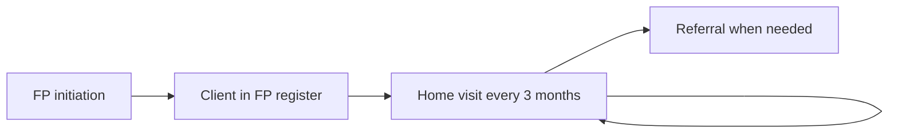

## Objective

Help women and men of reproductive age take up a family planning method, support them to continue, and refer to a facility for methods or problems the CHW cannot manage.

## How it works

1. The CHW opens **FP initiation** from a client's profile (women and men aged 12 to 49), or for a new mother from the PNC register.
2. The client joins the **Family Planning** register.
3. A home visit task appears every 3 months. The method can be changed at a visit.

## What the CHW records

| Form | Records |
|---|---|
| FP initiation | Interest in a method, method chosen, counselling on family planning and HIV and STI prevention, method details, referral |
| FP home visit | Method continuation or change, counselling, referral |

**Method details**

| Method | Also recorded |
|---|---|
| Male or female condoms | Number given |
| Combined or progesterone-only pills | Cycles given |
| Standard days method | Counselling on use |
| Emergency pill | Counselling towards a spacing or permanent method |
| Injectable | Referral |

## Referral triggers

Long-term methods, serious side effects, or commodities not available. See [Referral and counter-referral](./referral-counter-referral.md).

## What the system creates

| Form | FHIR records |
|---|---|
| FP initiation | A Family planning Condition (SNOMED 408969000), the method observation, the first follow-up task |
| FP home visit | The visit findings and the next visit task |

Commodities given are deducted from the CHW's stock. See [Community commodity management](./community-commodity-management.md).

## Integrations

- [Community referral to facility](../integrations/community-referral.md) (referral type `fp`)
- [Routine aggregate reporting](../integrations/routine-reporting.md) (new FP acceptors)

## Standards & FHIR artifacts

eCHIS Program Condition, Observation, Task and Service Request (Referral) profiles. Methods, side effects and danger signs are value sets in the [eCHIS FHIR Implementation Guide](https://palladium-group.github.io/datafi-echis-ig/integrated-care.html).

## Metadata packages

- FP questionnaires, the FP register config and the FP scheduling definition

See the [Metadata packages index](../standards/metadata-packages.md).
