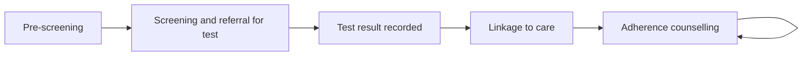

## Objective

Identify people at risk, help them get tested, confirm linkage to care, and support adherence to treatment. CHWs do not test or start treatment. Those happen at the facility.

## How it works

Each form closes the previous step and opens the next, so the **HIV** register shows where each client is. HIV and Tuberculosis share one entry in the app's side menu.

## What the CHW records

| Form | Records |
|---|---|
| Pre-screening | Eligibility, age and risk factors |
| Screening | Screening result and a referral for testing |
| Test results | The facility test result. A positive result enrols the client |
| Linkage to care | Confirmation the client is linked to a facility, and ART start |
| Adherence counselling | Adherence support at each follow-up visit |
| Referral closure | Outcome of a facility referral |

## What the system creates

| Form | FHIR records |
|---|---|
| Screening | A screening observation and a referral (ServiceRequest) for testing |
| Positive result | An HIV positive Condition (SNOMED 165816005) and a linkage task |
| Linkage and adherence | ART recorded as a Procedure (SNOMED 18629005) and the next visit task |

## Integrations

- [Community referral to facility](../integrations/community-referral.md) (referral type `hiv`)
- [Routine aggregate reporting](../integrations/routine-reporting.md)

## Standards & FHIR artifacts

eCHIS Program Condition, Observation, Procedure, Task and Service Request (Referral) profiles. Details in the [Implementation Guide integrated care page](https://palladium-group.github.io/datafi-echis-ig/integrated-care.html).

## Metadata packages

- HIV questionnaires, the HIV register config and the HIV scheduling definition

See the [Metadata packages index](../standards/metadata-packages.md).

