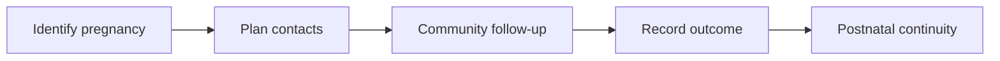

:::info Page details
**Workflow ID:** `DCS.MNCH.ANC` (proposed) · **Owner:** Ona (proposed) · **Status:** Draft
:::

## Objective

Maintain continuity from pregnancy identification through antenatal contacts, birth outcome, postnatal follow-up, danger-sign referral, and transition to routine maternal and child services.

## Process

## Activities

## Decision support

## Integrations

- [Community referral to facility](../integrations/community-referral.md)

## Standards & FHIR artifacts

See the [eCHIS FHIR Implementation Guide](https://palladium-group.github.io/datafi-echis-ig/).

## Metadata packages

## Tests
