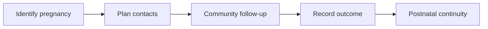

:::info Page details
**Workflow ID:** `DCS.MNCH.ANC` (proposed) · **Owner:** Ona (proposed) · **Status:** Draft
:::

## Objective

Maintain continuity from pregnancy identification through antenatal contacts, birth outcome, postnatal follow-up, danger-sign referral, and transition to routine maternal and child services.

This is an illustrative community workflow, not a clinical guideline. Countries should populate clinical content from approved national and WHO guidance.

## Process header

| Field | Value |
|---|---|
| Trigger | Pregnancy is identified in the community or linked from a facility record |
| End state | Pregnancy pathway closed, maternal and newborn follow-up tasks created, or the person transitioned to routine services |
| Primary persona | Community health worker |
| Supporting actors | Pregnant woman, supervisor, facility clinician |
| Locations | Household, community, and facility |
| Works offline? | Yes for community contacts. Facility linkage and referral exchange sync when connected |

## Process

## Activities

| ID | Activity | Actor | System action | Data created or reused |
|---|---|---|---|---|
| DCS.MNCH.ANC.01 | Identify pregnancy | Community health worker | Confirm the person record, capture pregnancy status and timing, record the source, and evaluate an immediate referral trigger | Pregnancy status, timing, source |
| DCS.MNCH.ANC.02 | Plan contacts | System | Create scheduled antenatal and community follow-up tasks | Task schedule |
| DCS.MNCH.ANC.03 | Community follow-up | Community health worker | Track scheduled and completed contacts, surface missed care, and record community counselling and referral | Attendance, counselling, referral status |
| DCS.MNCH.ANC.04 | Danger signs | Community health worker | Invoke the country-approved decision table, display urgent action, and create a referral | Referral, escalation, acknowledgment |
| DCS.MNCH.ANC.05 | Record birth outcome | Authorized source | Capture minimum outcome data, create or link the newborn, and update maternal status | Pregnancy outcome, newborn record, deaths and transfers under approved rules |
| DCS.MNCH.ANC.06 | Postnatal continuity | System | Schedule maternal and newborn tasks and close the pregnancy pathway | Follow-up tasks, immunization linkage, unresolved risks |

Do not duplicate the facility clinical record. Link to it when it is available. Record deaths and transfers only under approved rules.

## Decision support

| ID | Trigger | Rule | Output | Approved by |
|---|---|---|---|---|
| DCS.MNCH.ANC.DT.01 | Pregnancy identification or follow-up | Country-approved danger-sign table | Urgent action and referral | Clinical authority |

## Integrations

- [Community referral to facility](../integrations/community-referral.md)
- [Facility outcome and counter-referral](../integrations/counter-referral.md)

## Standards & FHIR artifacts

See the [eCHIS FHIR Implementation Guide](https://palladium-group.github.io/datafi-echis-ig/) for pregnancy status, estimated delivery date, and related profiles.

## Metadata packages

## Tests

Immediate referral on an approved danger sign. Missed contact surfaced. Facility record linked without duplication. Birth outcome from an authorized source. Postnatal tasks created and pregnancy pathway closed.
