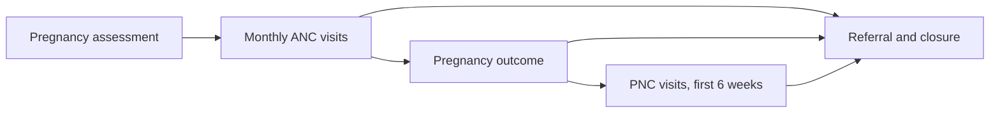

## Objective

Identify pregnant women early, support monthly antenatal care at home, record the birth outcome, and follow mother and baby through the first six weeks. The CHW encourages facility care and refers when danger signs appear. This is a community workflow, not a clinical guideline.

## How it works

1. The CHW opens **Pregnancy assessment** from a woman's profile (aged 16 to 49). She joins the ANC register.
2. A monthly **Record ANC Visit** task appears. Each visit sets the date of the next one.
3. After the birth, **Pregnancy outcome** moves her to the PNC register. Each baby is registered as a household member.
4. PNC visits cover mother and baby for six weeks, after which she leaves the PNC register.

## What the CHW records

| Form | Records |
|---|---|
| Pregnancy assessment | Whether the pregnancy was confirmed at a facility, ANC card, last menstrual period (the app calculates gestational age and expected delivery date), ANC visits so far, danger signs, HIV status |
| ANC home visit | Whether she made an ANC facility visit, MUAC, danger signs, date of the next visit |
| Pregnancy outcome | Born alive or stillborn, delivery date and place, mode of delivery, who delivered, number of babies, mother and newborn danger signs, FP commodities issued |
| PNC home visit | Child health card, baby weight, mother and baby danger signs, family planning uptake |
| Referral closure | Whether she reached the facility, which one, action taken, follow-up needed |

## Referral triggers

| When | Trigger |
|---|---|
| Pregnancy assessment | No ANC card (she is not enrolled until she has one), danger signs |
| ANC visit | Danger signs, red or yellow MUAC |
| Pregnancy outcome | Delivered in the community, delivered by a traditional birth attendant, mother or newborn danger signs |
| PNC visit | No child health card, mother or baby danger signs |

See [Referral and counter-referral](./referral-counter-referral.md).

## What the system creates

| Form | FHIR records |
|---|---|
| Pregnancy assessment | Pregnancy status and expected delivery date, a Pregnancy Condition (SNOMED 77386006), the first ANC task |
| ANC visit | Visit findings and the next ANC task |
| Pregnancy outcome | Pregnancy outcome, a Postpartum Condition (SNOMED 133906008), the first PNC task |
| PNC visit | Baby weight, danger signs and the next PNC task |

Pregnancy status, expected delivery date, outcome and baby weight follow International Patient Summary profiles. See [IPS alignment](../standards/ips-alignment.md).

## Integrations

- [Community referral to facility](../integrations/community-referral.md) (referral types `anc` and `pnc`)
- [Routine aggregate reporting](../integrations/routine-reporting.md)

## Standards & FHIR artifacts

eCHIS Pregnancy Status, Estimated Delivery Date, Pregnancy Outcome, Baby Weight, Program Condition and Task profiles. Details in the [Implementation Guide integrated care page](https://palladium-group.github.io/datafi-echis-ig/integrated-care.html).

## Metadata packages

- ANC and PNC questionnaires, register configs and scheduling definitions

See the [Metadata packages index](../standards/metadata-packages.md).
