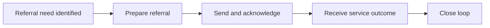

:::info Page details
**Workflow ID:** `DCS.REF` (proposed) · **Owner:** Ona (proposed) · **Status:** Draft
:::

## Objective

Move a person from community service to an appropriate facility or service, transmit the minimum referral information, receive the service outcome, and create a community follow-up task.

## Process header

| Field | Value |
|---|---|
| Trigger | A referral need is identified during community service |
| End state | Referral status updated from the service outcome, and a community follow-up task created |
| Primary persona | Community health worker |
| Supporting actors | Client, supervisor, receiving facility |
| Locations | Community and facility |
| Works offline? | The referral can be prepared offline. Send, acknowledgment, and outcome return when connected |

## Process

## Activities

| ID | Activity | Actor | System action | Data created or reused |
|---|---|---|---|---|
| DCS.REF.01 | Identify need | Community health worker | Record reason, urgency, person, referring worker, and destination options | Referral reason |
| DCS.REF.02 | Prepare referral | Community health worker | Confirm destination, minimum summary, consent or legal basis, transport, and contact plan | Referral draft |
| DCS.REF.03 | Send and acknowledge | System | Transmit the referral and record the destination response | Destination identifier, acknowledgment |
| DCS.REF.04 | Receive outcome | Facility, via exchange | Return encounter result, disposition, and treatment or follow-up information allowed for exchange | Service outcome |
| DCS.REF.05 | Close the loop | System | Update referral status and create the community follow-up task | Follow-up task |

## Country adaptation

Answer these before configuration:

- Which cadres may initiate each referral?
- Which referral reasons and urgency categories apply?
- What information may cross organizational boundaries?
- Which system owns referral status?
- What confirms receipt, service completion, and closure?
- How are failures, duplicates, rejected referrals, and people who do not arrive handled?

## Decision support

| ID | Trigger | Rule | Output | Approved by |
|---|---|---|---|---|
| DCS.REF.DT.01 | Referral need | Approved reason and urgency for the cadre | Referral prepared or not allowed | Clinical and program authority |
| DCS.REF.DT.02 | Outcome returned | Approved closure rules | Status updated and follow-up task created | Program authority |

## Integrations

- [Community referral to facility](../integrations/community-referral.md)
- [Facility outcome and counter-referral](../integrations/counter-referral.md)

## Standards & FHIR artifacts

See the [eCHIS FHIR Implementation Guide](https://palladium-group.github.io/datafi-echis-ig/) for the referral ServiceRequest profile.

## Metadata packages

## Tests

Referral blocked for a cadre or reason that is not approved. Minimum summary and consent recorded before send. Duplicate send prevented. Outcome updates status and creates one follow-up task. Person does not arrive, referral rejected, and delayed acknowledgment are visible to the community team.
