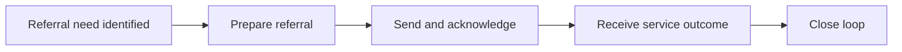

:::info Page details
**Workflow ID:** `DCS.REF` (proposed) · **Owner:** Ona (proposed) · **Status:** Draft
:::

## Objective

Move a person from community service to an appropriate facility or service, transmit the minimum referral information, receive the service outcome, and create a community follow-up task.

## Process

## Activities

## Decision support

## Integrations

- [Community referral to facility](../integrations/community-referral.md)
- [Facility outcome and counter-referral](../integrations/counter-referral.md)

## Standards & FHIR artifacts

See the [eCHIS FHIR Implementation Guide](https://palladium-group.github.io/datafi-echis-ig/).

## Metadata packages

## Tests
