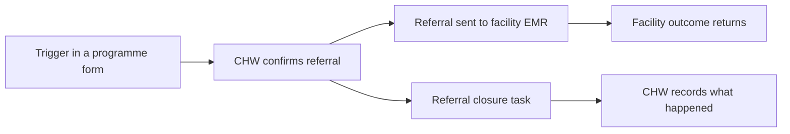

## Objective

Get clients who need facility care to the right facility, make sure the facility knows they are coming and why, and close the loop in the community once they have been seen.

## How it works

1. A finding in a programme form, such as a danger sign, prompts a referral. The CHW confirms it at the end of the form.
2. The referral goes to the facility EMR with a summary of the client's community history.
3. A **referral closure** task appears for the CHW.
4. When the facility completes the referral, the outcome and clinician's note come back to the community record.

## Referral triggers

| Programme | Triggers |
|---|---|
| ANC and PNC | Danger signs, red or yellow MUAC, no ANC card, no child health card, community or traditional birth attendant delivery. See [Maternal and newborn](./maternal-newborn-continuity.md) |
| Child health | Immunizations not up to date, red or yellow MUAC, swelling, danger signs, severe illness, any sick child under 2 months. See [Child health](./child-health-immunization.md) |
| Family planning | Long-term methods, serious side effects, commodities not available. See [Family planning](./family-planning.md) |
| HIV and TB | Referral for testing after screening. See [HIV](./hiv-care-cascade.md) and [TB](./tb-care-cascade.md) |

## What the CHW records at closure

| Field | Notes |
|---|---|
| Did the client visit the facility | |
| Facility visited | |
| Action taken | Treated and sent home, admitted, or other |
| Follow-up needed | |

## What the system creates

| Step | FHIR records |
|---|---|
| Referral | A ServiceRequest (SNOMED 3457005, patient referral) with the referral type: `anc`, `pnc`, `child`, `hiv`, `fp` or `tb` |
| At the facility | A patient, encounter and referral order in OpenMRS |
| Facility outcome | A ClinicalImpression with the clinician's note, and the ServiceRequest marked completed |

## Integrations

- [Community referral to facility](../integrations/community-referral.md)
- [Facility outcome and counter-referral](../integrations/counter-referral.md)

## Standards & FHIR artifacts

eCHIS Service Request (Referral) profile in the [eCHIS FHIR Implementation Guide](https://palladium-group.github.io/datafi-echis-ig/).

## Metadata packages

- Referral closure forms in each programme module, and the OpenMRS referral metadata

See the [Metadata packages index](../standards/metadata-packages.md).

