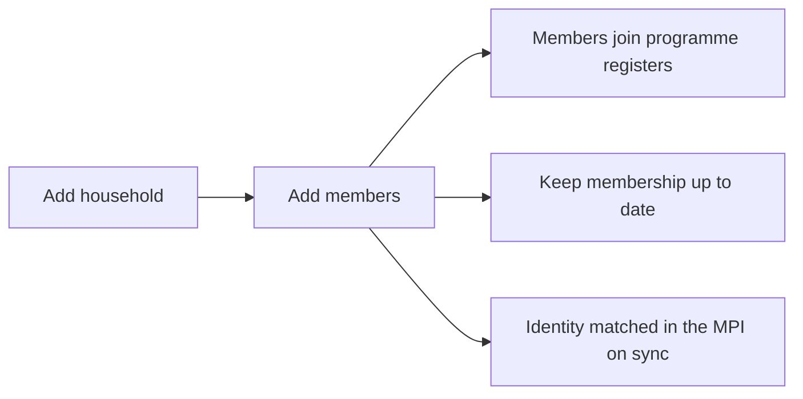

## Objective

Register every household and its members so the community health worker (VHT in the reference build) can plan visits and enrol people into programmes. Registration is the first step: a client cannot be added until their household exists.

## How it works

1. From the **All Households** register (the app's home page), the CHW taps **Add household**.
2. From the household profile they add each member with **Add household member**.
3. From a member's profile they enrol them into programmes, for example a pregnancy assessment or family planning.
4. Over time they edit household details, change the household head, and mute, unmute or record the death of members.

## What the CHW records

**Household**

| Field | Notes |
|---|---|
| Household name | |
| Village | |
| GPS location | **Record GPS location** button |
| Household ID | Generated by the app |

**Household member**

| Field | Notes |
|---|---|
| Surname, given name, middle name | Surname can be the household name |
| Sex | |
| Date of birth | Tick **date of birth unknown** to enter age in years and months instead |
| Client category | Citizen, refugee or foreigner |
| National ID (NIN) | |
| Phone number | |
| Household head | Yes or no |
| Visitor | Yes or no, required |
| OpenSRP ID | Generated by the app |

## Keeping the household up to date

| Action | Where | Effect |
|---|---|---|
| Edit household details | Household profile menu | Change the name or village |
| Change household head | Household profile menu | Pick from the members who qualify |
| Mute a member | Member profile menu | Reason required. Member shows as **Muted** and their tasks are deactivated |
| Unmute a member | Member profile menu | Tasks are reactivated |
| Record a death | Member profile menu, **Death report** | Cannot be undone. Member shows greyed out and deceased, and their tasks are withdrawn. See [Death reporting](./death-reporting.md) |

## Enrolling into programmes

From a member's profile menu:

| Who | Action | Register |
|---|---|---|
| Children under 5 | Added automatically | Children. See [Child health](./child-health-immunization.md) |
| Women aged 16 to 49 | **Pregnancy assessment** | ANC. See [Maternal and newborn](./maternal-newborn-continuity.md) |
| Women and men aged 12 to 49 | **FP initiation** | Family Planning. See [Family planning](./family-planning.md) |
| Sick children | **Sick assessment** | See [Child health](./child-health-immunization.md) |

## Finding households and clients

- The All Households register shows each household's name, village and ID, icons for its members (children, pregnant women), and its task status, which turns red when visits are overdue.
- The search bar on every register finds a household by name or ID, or a client by name or ID.

## What the system creates

| Action | FHIR records |
|---|---|
| Add household | A household Group (SNOMED 35359004) and its GPS location |
| Add member | A Patient with the OpenSRP ID, record UUID and, when captured, National ID. A disability Condition (SNOMED 21134002) when flagged. The first programme tasks |
| Mute, unmute, remove | An Observation recording the change and the reason |

On sync, every new member is matched in the master patient index and given an enterprise ID. See [Identity reconciliation](../integrations/identity-reconciliation.md).

## Integrations

- [Identity reconciliation](../integrations/identity-reconciliation.md)

## Standards & FHIR artifacts

eCHIS Household and eCHIS Patient profiles, and the [patient identifiers](../standards/terminology.md#patient-identifiers). Details in the [Implementation Guide integrated care page](https://palladium-group.github.io/datafi-echis-ig/integrated-care.html).

## Metadata packages

- Household questionnaires, the household register and profile configs

See the [Metadata packages index](../standards/metadata-packages.md).

