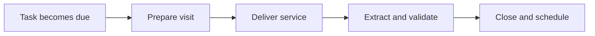

:::info Page details
**Workflow ID:** `DCS.VISIT.SCH` (proposed) · **Owner:** Ona (proposed) · **Status:** Draft
:::

## Objective

Help the community health worker identify due work, complete the appropriate service form, record structured outputs, and create the next follow-up action.

## Process

## Activities

## Decision support

## Integrations

- [Analytics ingestion and transformation](../integrations/analytics-ingestion.md)

## Standards & FHIR artifacts

See the [eCHIS FHIR Implementation Guide](https://palladium-group.github.io/datafi-echis-ig/).

## Metadata packages

## Tests
