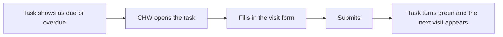

## Objective

Help the community health worker (VHT in the reference build) see which visits are due, record each one, and have the next visit scheduled automatically.

## How a visit works

1. Due and overdue visits show on the registers and on each client's profile.
2. The CHW taps the task, for example **Record ANC Visit**, to open the visit form.
3. They fill in the form and submit. Findings such as danger signs or a red or yellow MUAC prompt a referral.
4. The task is marked complete and the next visit appears as an upcoming task.

## Visit schedules

| Programme | When visits happen |
|---|---|
| ANC | Monthly. The CHW records the date of the next ANC visit on each visit form |
| PNC | During the first 6 weeks after birth, for mother and baby. The mother leaves the PNC register after 6 weeks |
| Child | A monthly routine visit for children under 5. It can only be recorded when due or overdue. Vitamin A from 6 months and deworming from 12 months follow their own schedule |
| Family planning | Every 3 months |
| Referral follow-up | A referral closure task appears after a referral, to record what happened at the facility |

## Task status

| Shown as | Meaning |
|---|---|
| Blue box with a number | Visits due. "Home visit" means a follow-up visit is due |
| Red box with a number | Visits overdue. The household status also turns red |
| Blank box | Nothing due |
| Grey button with a green icon | All due visits done |

## What changes the schedule

- **Muting** a household member deactivates their tasks. Unmuting brings them back.
- **Recording a death** marks the member deceased and withdraws their tasks.
- **Recording a pregnancy outcome** moves the mother from ANC to PNC visits.
- **A missed visit** stays overdue in the register. The next visit in that programme is only created when this one is recorded.

## Offline

After the first login and sync, visits can be recorded with no connection. Records stay on the device until the CHW syncs from the side menu.

## Behind the scenes

Each submitted form creates the record of the visit and exactly one next-visit Task, with its due date and the form to open next. There is no care plan built in advance. See the [Implementation Guide scheduling page](https://palladium-group.github.io/datafi-echis-ig/scheduling.html).

## Integrations

- [Analytics ingestion and transformation](../integrations/analytics-ingestion.md)

Referral, supply and surveillance exchanges come from the programme form used in the visit. See the programme workflow pages.

## Standards & FHIR artifacts

eCHIS Task and Visit Encounter profiles in the [eCHIS FHIR Implementation Guide](https://palladium-group.github.io/datafi-echis-ig/).

## Metadata packages

- Scheduling definitions and register configs for each programme. See the programme workflow pages

See the [Metadata packages index](../standards/metadata-packages.md).
