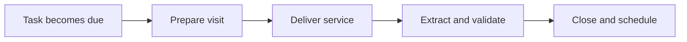

:::info Page details
**Workflow ID:** `DCS.VISIT.SCH` (proposed) · **Owner:** Ona (proposed) · **Status:** Draft
:::

## Objective

Help the community health worker identify due work, complete the appropriate service form, record structured outputs, and create the next follow-up action.

## Process header

| Field | Value |
|---|---|
| Trigger | A task becomes due by date, priority, person, service package, and assignment |
| End state | Current task completed, structured outputs recorded, and successor task created when required |
| Primary persona | Community health worker |
| Supporting actors | Client, supervisor |
| Locations | Household and community |
| Works offline? | Yes. Locally available history is shown; the complete transaction is saved locally and queued for sync |

## Process

## Activities

| ID | Activity | Actor | System action | Data created or reused |
|---|---|---|---|---|
| DCS.VISIT.SCH.01 | Select due task | Community health worker | List tasks by date, priority, person, service package, and assignment | Task status |
| DCS.VISIT.SCH.02 | Prepare visit | Community health worker | Show minimum history, risks, prior actions, and required commodities available on the device | Prior encounter and referral summary |
| DCS.VISIT.SCH.03 | Deliver service | Community health worker | Present the approved questionnaire for counselling, treatment, observation, or referral | Service provided, observations, counselling, commodity use |
| DCS.VISIT.SCH.04 | Extract and validate | System | Create structured records and verify required outputs | Encounter date, observations, referral |
| DCS.VISIT.SCH.05 | Close and schedule | System | Complete the current task, create the successor task, and synchronize approved records | Follow-up date, task status |

In the reference eCHIS, step 04 uses template extraction to create FHIR records. Other platforms can produce the same structured outputs by another method. See [Standards](../standards/index.md).

## Decision support

| ID | Trigger | Rule | Output | Approved by |
|---|---|---|---|---|
| DCS.VISIT.SCH.DT.01 | Task selection | Eligibility, overdue handling, and next-service calculation | Due, overdue, or not eligible | Program authority |
| DCS.VISIT.SCH.DT.02 | During the visit | Danger signs or required referral | Referral task or urgent action | Clinical authority |

## Illustrative data

Task status, encounter date, observations, service provided, counselling, commodity use, referral, and follow-up date. Full data elements stay in the country data dictionary.

## Exceptions

Person moved, unavailable, or deceased. Duplicate task. Stock unavailable. Device reassigned. Task cancelled.

## Offline behavior

Show locally available history. Save the complete transaction locally. Prevent double submission. Queue synchronization.

## Measures

Due tasks completed, overdue tasks, successful sync, service coverage, referral initiated, and data completeness.

## Integrations

- [Analytics ingestion and transformation](../integrations/analytics-ingestion.md)

Referral, supply, and surveillance exchanges are triggered by the service workflow that runs inside the visit, not by the visit shell itself.

## Standards & FHIR artifacts

Linked assets in the reference implementation: questionnaire, extraction template, Task profile, and terminology. See the [eCHIS FHIR Implementation Guide](https://palladium-group.github.io/datafi-echis-ig/).

## Metadata packages

## Tests

Eligibility and overdue paths. Offline save and later sync. Duplicate submission blocked. Successor task created once. Required outputs missing. Referral initiated from a danger-sign rule.
