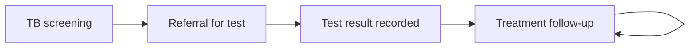

## Objective

Find people with TB symptoms, including household contacts, get them tested, and support them through treatment. Diagnosis and starting treatment happen at the facility.

## How it works

Clients diagnosed with TB appear in the **Tuberculosis** register, which shares a side menu entry with HIV.

## What the CHW records

| Form | Records |
|---|---|
| TB screening | Cough, fever, night sweats, weight loss and TB exposure, and a referral for testing |
| TB test result | The facility test result. A positive result enrols the client |
| TB follow-up | Treatment given and adherence |
| Referral closure | Outcome of a facility referral |

## What the system creates

| Form | FHIR records |
|---|---|
| Screening | Symptom observations and a referral (ServiceRequest) for testing |
| Positive result | A Tuberculosis Condition (SNOMED 56717001) and a follow-up task |
| Follow-up | Treatment recorded as a Procedure (SNOMED 18629005) and the next visit task |

## Integrations

- [Community referral to facility](../integrations/community-referral.md) (referral type `tb`)
- [Routine aggregate reporting](../integrations/routine-reporting.md)

## Standards & FHIR artifacts

eCHIS Program Condition, Observation, Procedure, Task and Service Request (Referral) profiles. Details in the [Implementation Guide integrated care page](https://palladium-group.github.io/datafi-echis-ig/integrated-care.html).

## Metadata packages

- TB questionnaires, the TB register config and the TB scheduling definition

See the [Metadata packages index](../standards/metadata-packages.md).

