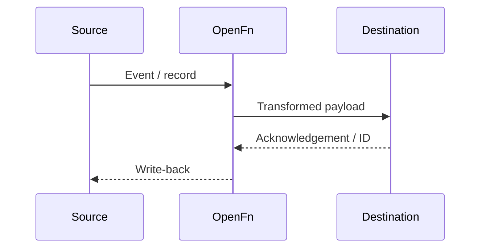

---
# Copy to docs/integrations/<short-name>.md and fill in. Delete any section that doesn't apply.
title: <Integration name>
description: <One sentence: what outcome this exchange achieves.>
sidebar_position: <10, 20, 30…>
owner: <Team responsible, e.g. OpenFn>
status: draft # draft | in-review | approved
dcs_id: DCS.INT.<AREA>.<NN> # e.g. DCS.INT.REF.01
---

:::info Page details
**Interface ID:** `DCS.INT.<AREA>.<NN>` · **Owner:** <team> · **Status:** Draft
:::

## Overview

| Field | Value |
|---|---|
| Outcome | |
| Pattern | Transactional · Closed-loop · Analytical |
| Source → destination | |
| Direction | Push · Pull · Bidirectional |
| Trigger | |
| Used by workflows | <links to workflow pages> |

## Sequence

## Preconditions

<Metadata, identifiers, permissions, configuration and dependencies required.>

## Processing steps

1.

## Mapping

| Source | Destination | Transformation | Terminology |
|---|---|---|---|
| | | | |

## Reliability

<Idempotency, retries, hold queue, replay, reconciliation, manual remediation.>

## Security

<Transport, authentication, authorization, credentials, logging, retention.>

## Monitoring

<Run summary, alerts, dashboards, support owner, escalation.>

## Standards & FHIR artifacts

<Links into the FHIR IG.>

## Metadata packages

<OpenFn job, mapping files, example payloads, test fixtures, with version.>

## Tests

<Contract, negative, volume, replay and end-to-end scenarios.>
