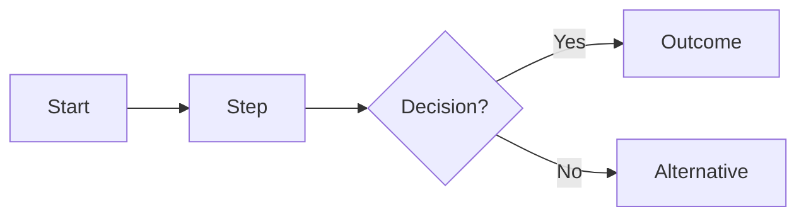

---
# Copy to docs/workflows/<short-name>.md and fill in. Delete any section that doesn't apply.
title: <Workflow name>
description: <One sentence: what service outcome this workflow achieves.>
sidebar_position: <10, 20, 30… leave gaps so pages can be inserted later>
owner: <Team responsible, e.g. Ona>
status: draft # draft | in-review | approved
dcs_id: DCS.<DOMAIN>.<PROCESS> # e.g. DCS.MNCH.ANC
---

:::info Page details
**Workflow ID:** `DCS.<DOMAIN>.<PROCESS>` · **Owner:** <team> · **Status:** Draft
:::

## Objective

<What the user achieves and the source guidance it follows.>

## Process header

| Field | Value |
|---|---|
| Trigger | |
| End state | |
| Primary persona | |
| Supporting actors | |
| Locations | |
| Works offline? | |

## Process

## Activities

| ID | Activity | Actor | System action | Data created / reused |
|---|---|---|---|---|
| DCS.<DOMAIN>.<PROCESS>.01 | | | | |

## Decision support

| ID | Trigger | Rule | Output | Approved by |
|---|---|---|---|---|
| DCS.<DOMAIN>.<PROCESS>.DT.01 | | | | |

## Integrations

<Link each integration this workflow triggers, e.g. [Community referral](../integrations/community-referral.md).>

## Standards & FHIR artifacts

<Link the FHIR profiles and value sets used, e.g. [eCHIS Service Request (Referral)](https://palladium-group.github.io/datafi-echis-ig/).>

## Metadata packages

<Forms, questionnaires, DHIS2 metadata or other configuration this workflow ships with, with version.>

## Tests

<Positive, negative, offline, sync, duplicate and recovery scenarios, or a link to the test cases.>
